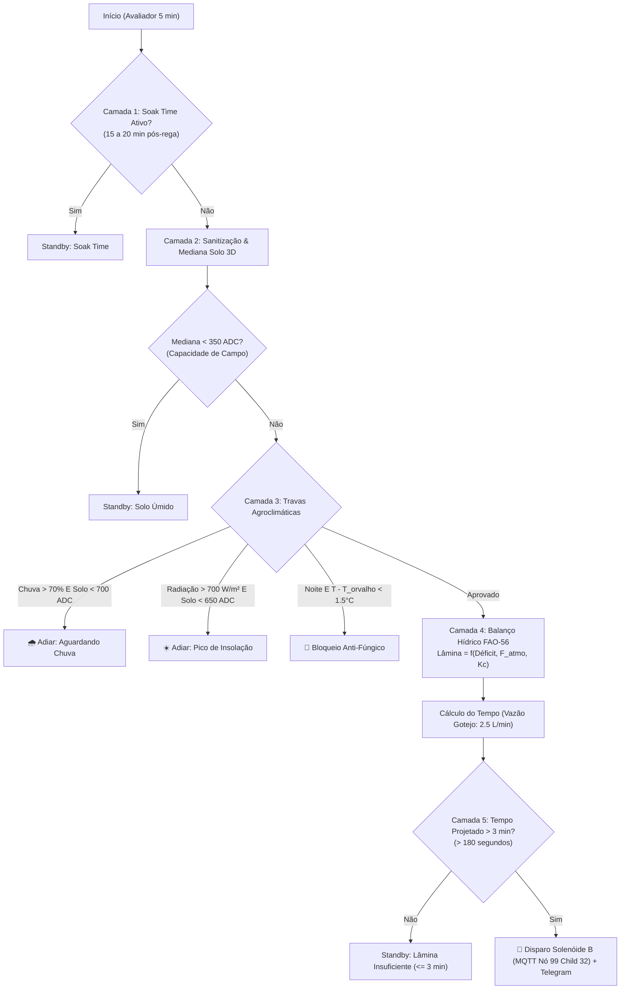

# Especificação Técnica: Motor de Irrigação Agroclimático Manejo360 (Canteiro B)

**Projeto:** Sistema IoT M360 Horta — Estufa Inteligente  
**Módulo:** Motor de Regras do Canteiro B (`tab_irrigacao_m360` no Node-RED)  
**Localização da Estufa:** `15°57'50.2"S 47°48'14.5"W` (`-15.963944, -47.804028` — Brasília/DF)  
**Data de Implementação:** Agosto / 2026  

---

## 1. Visão Geral e Objetivos Agronômicos

O **Motor Agroclimático do Canteiro B** foi projetado para substituir lógicas estáticas de irrigação por um sistema inteligente de **balanço hídrico preditivo**, reduzindo o consumo de água e energia, prevenindo doenças fúngicas e garantindo o fornecimento hídrico ótimo para o cultivo de hortaliças (alface, $6\text{ m} \times 1\text{ m}$, 35 plantas).

O sistema opera na aba `tab_irrigacao_m360` do Node-RED e funde em tempo real:
1. **Telemetria de Solo Subterrâneo (Nó 02):** 6 canais resistivos 3D (profundidades de 10, 20 e 30 cm).
2. **Microclima Interno da Estufa (Nó 99):** Sensor DHT11 (temperatura e umidade do ar) e medidor de vazão YF-S201.
3. **Agro-Meteorologia Hiperlocal (API Open-Meteo):** Evapotranspiração de Referência ($ET_0$ FAO-56 Penman-Monteith), Déficit de Pressão de Vapor (VPD), Radiação Solar Global, Velocidade do Vento, Ponto de Orvalho, Modelo Geofísico de Solo (ECMWF) e Previsão de Chuva.

---

## 2. Mapa Completo de Variáveis Utilizadas

### 2.1 API Open-Meteo (Consulta Periódica a cada 30 min)
* **Endpoint:**
  ```http
  https://api.open-meteo.com/v1/forecast?latitude=-15.963944&longitude=-47.804028&hourly=precipitation_probability,precipitation,temperature_2m,relative_humidity_2m,dew_point_2m,et0_fao_evapotranspiration,vapour_pressure_deficit,shortwave_radiation_instant,wind_speed_10m,soil_temperature_0cm,soil_moisture_0_to_1cm&forecast_days=2&timezone=America%2FSao_Paulo
  ```

| Variável | Tipo / Unidade | Aplicação Agronômica |
|---|:---:|---|
| `et0_fao_evapotranspiration` | `float` (mm/h) | Cálculo da evapotranspiração da cultura ($ET_c = ET_0 \times K_c$). |
| `vapour_pressure_deficit` (VPD) | `float` (kPa) | Avaliação da transpiração estomática. Se $> 1.8\text{ kPa}$, aplica $+15\%$ na lâmina de reposição. |
| `shortwave_radiation_instant` | `float` (W/m²) | Janela de pico solar. Se $> 700\text{ W/m²}$ (ou entre 12h–13h), adia a rega para evitar choque térmico nas raízes. |
| `wind_speed_10m` | `float` (km/h) | Perda advectiva. Se $> 20\text{ km/h}$, adiciona $+10\%$ no tempo de reposição. |
| `dew_point_2m` | `float` (°C) | Prevenção fúngica. Se $T - T_{\text{orvalho}} < 1.5^\circ\text{C}$ à noite, bloqueia regas para evitar molhamento foliar propício a *Botrytis* e míldio. |
| `precipitation_probability` | `int` (%) | Previsão de chuva nas próximas 4h. Se $> 70\%$, adia a rega aguardando a precipitação. |
| `precipitation` | `float` (mm) | Precipitação acumulada prevista para dedução do balanço. |
| `soil_temperature_0cm` | `float` (°C) | Monitoramento térmico da camada superficial do solo. |
| `soil_moisture_0_to_1cm` | `float` (m³/m³) | Auditoria e calibração cruzada com os sensores físicos do Nó 02. |

### 2.2 Telemetria da Rede IoT (Nós 02 e 99)

| Nó / Child | Sensor | Variável | Função |
|:---:|---|:---:|---|
| **Nó 02** (1–6) | Sensor 3D Inox | `V_LEVEL` (37) | Leituras analógicas brutas de umidade (0 a 1023 ADC). |
| **Nó 99** (11) | DHT11 Interno | `V_TEMP` (0) | Temperatura interna do ar na estufa (°C). |
| **Nó 99** (12) | DHT11 Interno | `V_HUM` (1) | Umidade relativa interna do ar na estufa (%). |
| **Nó 99** (21) | YF-S201 | `V_FLOW` (34) | Vazão real da linha de irrigação (L/min). |
| **Nó 99** (32) | Solenóide B | `V_STATUS` (2) | Válvula de gotejamento do Canteiro B (Child 32). |

---

## 3. Pipeline de Decisão em 5 Camadas (`fn_motor_regras_canteiro_b`)

O nó avaliador dispara a cada **5 minutos** e processa as seguintes camadas sequenciais:



### 3.1 Camada 1: Trava de Absorção (Soak Time)
Bloqueia novos disparos por **15 minutos** ($T \ge 18^\circ\text{C}$) ou **20 minutos** ($T < 18^\circ\text{C}$) após qualquer rega, permitindo que a água infiltre por capilaridade e atinja o bulbo úmido antes de nova leitura.

### 3.2 Camada 2: Sanitização de Leituras
Filtra leituras espúrias ($\text{ADC} < 0$ ou $\text{ADC} > 1023$, ou idade $> 30\text{ min}$) dos sensores do Nó 02 e extrai a **mediana estatística** dos sensores válidos.

### 3.3 Camada 3: Travas de Segurança Agroclimática
1. **Solo Úmido ($\text{Mediana} < 350\text{ ADC}$):** Solo em capacidade de campo $\implies$ mantém *Standby*.
2. **Previsão de Chuva Iminente ($> 70\%$):** 
   - Se $\text{Mediana} < 700\text{ ADC}$: Adia a irrigação aguardando a chuva natural (economia hídrica).
   - Se $\text{Mediana} \ge 700\text{ ADC}$: Dispara **Irrigação de Emergência por Estresse Hídrico Crítico** (a chuva demorou e as plantas não podem mais esperar).
3. **Pico de Radiação Solar ($> 700\text{ W/m²}$ ou 12h–13h):** Adia a rega para o início da tarde para evitar choque térmico nas raízes por água superaquecida nas tubulações e minimizar perdas por evaporação imediata (salvo se solo $\ge 650\text{ ADC}$).
4. **Proteção Anti-Fúngica Noturna:** Se for período noturno (20h às 05h) e a margem do ponto de orvalho for estreita ($T_{\text{ar}} - T_{\text{orvalho}} < 1.5^\circ\text{C}$), bloqueia regas que aumentem o molhamento foliar, prevenindo proliferação de fungos.

### 3.4 Camada 4: Balanço Hídrico Real (FAO-56 Penman-Monteith)
Calcula o fator de demanda atmosférica:
$$F_{\text{atmo}} = 1.0 + \Delta_{\text{VPD}} + \Delta_{\text{Vento}} + \Delta_{\text{Estufa}}$$
- $\Delta_{\text{VPD}} = +0.15$ se $\text{VPD} > 1.8\text{ kPa}$
- $\Delta_{\text{Vento}} = +0.10$ se $\text{Vento} > 20\text{ km/h}$
- $\Delta_{\text{Estufa}} = +0.15$ se $T_{\text{DHT}} > 25^\circ\text{C}$ e $H_{\text{DHT}} < 18\%$

Lâmina líquida requerida:
$$L_{\text{req}} = \left( \frac{\text{Mediana} - 350}{500} \times 3.5\text{ mm} \right) \times F_{\text{atmo}} \quad (\text{Cap máximo: } 4.5\text{ mm})$$

Volume em litros ($6\text{ m}^2$):
$$V = L_{\text{req}} \times 6.0\text{ Litros}$$

Tempo de acionamento ($Q = 2.5\text{ L/min} = 0.04167\text{ L/s}$):
$$t_{\text{seg}} = \frac{V}{0.04167}$$

### 3.5 Camada 5: Regra de Corte Mínimo (> 3 minutos)
$$\text{Se } t_{\text{seg}} \le 180\text{ s} \implies \text{Retorna null (Standby)}$$
Elimina micropulsos ineficazes que não chegam à rizosfera profunda.

---

## 4. Comunicação MQTT e Telegram

### 4.1 Comandos MQTT (Formato Nativo M360)
* **Ligar Solenóide B:**
  - Tópico: `m360/DF/0000/in/99/32/1/0/2`
  - Payload: `"1"`
* **Desligar Solenóide B:**
  - Tópico: `m360/DF/0000/in/99/32/1/0/2`
  - Payload: `"0"`

### 4.2 Notificações no Telegram (`@M360HortaBot`)
Disparadas no início e no fim da irrigação com os indicadores agroclimáticos completos:

```markdown
💧 IRRIGAÇÃO INICIADA

📍 Local: Canteiro B (Manejo360)
⏱️ Duração: 4 minutos e 30 segundos
⚙️ Modo: Balanço Hídrico Agroclimático (FAO-56 Penman-Monteith)
📊 Parâmetros Agroclimáticos:
 • Mediana Solo: 540.0 ADC
 • Lâmina: 1.8 mm (10.8 L)
 • ET₀: 0.35 mm/h
 • VPD: 1.95 kPa
 • Radiação: 380 W/m²
 • Vento: 12.5 km/h
 • Chuva 4h: 12%
 • Clima Estufa: 26.5°C / 22%
 • Tempo Projetado: 4 min 30s

🕒 Horário: 16:30:15 (Horário de Brasília)
```

---

## 5. Rastreabilidade de Arquivos

* **Fluxo Ativo Node-RED:** Tab `tab_irrigacao_m360`
* **Definição JSON Versionada:** [`src/DRY/horta/nodered/flows.json`](../src/DRY/horta/nodered/flows.json)
* **Inventário de Nós:** [`src/DRY/horta/inventario.md`](../src/DRY/horta/inventario.md)
