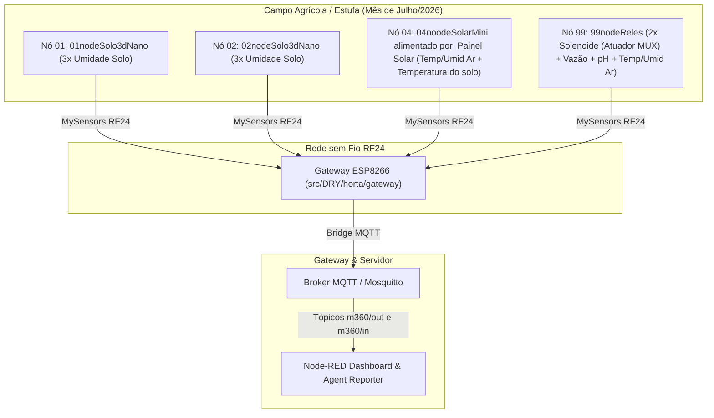

# Relatório Consolidado de Desenvolvimento e Engenharia — Sistema Manejo360

Este conjunto documental apresenta a consolidação de todas as atividades de desenvolvimento, engenharia de software, especificação de hardware e comissionamento de campo do sistema de monitoramento e automação agrícola **Manejo360**.

---

## 1. Visão Geral do Sistema

O **Manejo360** é uma plataforma IoT de alta eficiência voltada para o monitoramento microclimático, de umidade/temperatura do solo e controle da irrigação agrícola. 

### Arquitetura do Sistema

Total de 12 Sensors e 2 atuadores de irrigação Instalados"
---

## 2. Estrutura do Relatório e Capítulos

O relatório técnico está dividido em 3 capítulos fundamentais, correlacionados com as emissões de Notas Fiscais dos serviços executados e com os marcos operacionais de campo:

- **[Capítulo 1 — Entrega NF 13/02/2026](file:///c:/Users/jmarc/Documents/PlatformIO/Projects/Manejo360/docs/relatorio/01_relatorio_entrega_13-02-2026.md)**  
  *Concepção da Arquitetura Manejo360, Scaffolding da Biblioteca Mysensors -> LibDRY (utilizando o método DRY - Dont Repeat Yourself), Especificações Iniciais e Documentação Conceitual (Documento Técnico, Arquitetura IoT).*
- **[Capítulo 2 — Entrega NF 04/05/2026](file:///c:/Users/jmarc/Documents/PlatformIO/Projects/Manejo360/docs/relatorio/02_relatorio_entrega_04-05-2026.md)**  
  *Estruturação Física da Estufa Agrícola MVP (01/05 a 01/06/2026), LibDRY, Perfis de Energia, Adaptador Eletrônico RFM95W e Especificações de Backend/Hardware (API MQTT v1.0, DB Design v1.0, Hardware IoT, Gateway Wemos JSON, LoRa Neutra, Durabilidade de Sensores).*
- **[Capítulo 3 — Entrega NF 07/08/2026](file:///c:/Users/jmarc/Documents/PlatformIO/Projects/Manejo360/docs/relatorio/03_relatorio_entrega_07-08-2026.md)**  
  *Comissionamento e Instalação em Campo (Mês de Julho/2026) do Gateway ESP8266 + 2 Nós Sensores/Atuadores + 12 Sensores + Automação Node-RED.*
  *(Nota: A automação Node-RED foi uma solução temporária de baixo custo para viabilizar o comissionamento imediato do sistema em campo, enquanto a arquitetura definitiva com agente LLM dedicado esta em desenvolvimento e homologação.)*

---

## 3. Catálogo Integrado de Documentos Técnicos Incorporados

Como entregáveis oficiais do projeto **Manejo360**, foram incorporados os seguintes 14 artefatos de documentação detalhada provenientes de `ViridIoTech/Projetos/Manejo360/Documentação`:

| Documento Técnico | Descrição / Escopo | Capítulo de Referência |
|---|---|---|
| **[00. Documento Técnico Manejo360.md](file:///d:/Meu%20Drive/GDrive%20Meus%20Documentos/Projetos%20(1)/ViridIoTech/Projetos/Manejo360/Documenta%C3%A7%C3%A3o/00.%20Documento%20T%C3%A9cnico%20%20Manejo360.md)** | Visão Geral e Requisitos da Plataforma Manejo360 | Capítulo 1 (NF 13/02/2026) |
| **[Arquitetura IOT.md](file:///d:/Meu%20Drive/GDrive%20Meus%20Documentos/Projetos%20(1)/ViridIoTech/Projetos/Manejo360/Documenta%C3%A7%C3%A3o/Arquitetura%20IOT.md)** | Arquitetura Geral IoT e Topologia Sem Fio | Capítulo 1 (NF 13/02/2026) |
| **[BMC Manejo360 v_3.2.md](file:///d:/Meu%20Drive/GDrive%20Meus%20Documentos/Projetos%20(1)/ViridIoTech/Projetos/Manejo360/Documenta%C3%A7%C3%A3o/BMC%20%20Manejo360%20v_3.2.md)** | Business Model Canvas Manejo360 (v3.2) | Capítulo 1 (NF 13/02/2026) |
| **[Dor e Persona.md](file:///d:/Meu%20Drive/GDrive%20Meus%20Documentos/Projetos%20(1)/ViridIoTech/Projetos/Manejo360/Documenta%C3%A7%C3%A3o/Dor%20e%20Persona.md)** | Mapeamento de Persona e Dores do Produtor | Capítulo 1 (NF 13/02/2026) |
| **[PicthDeck_(Convergencia-GO)_Manejo 360.pdf](file:///d:/Meu%20Drive/GDrive%20Meus%20Documentos/Projetos%20(1)/ViridIoTech/Projetos/Manejo360/Documenta%C3%A7%C3%A3o/PicthDeck_(Convergencia-GO)_Manejo%20360.pdf)** | Pitch Deck Institucional do Manejo360 | Capítulo 1 (NF 13/02/2026) |
| **[01. API do Backend e Tópicos MQTT v1.0.md](file:///d:/Meu%20Drive/GDrive%20Meus%20Documentos/Projetos%20(1)/ViridIoTech/Projetos/Manejo360/Documenta%C3%A7%C3%A3o/01.%20API%20do%20Backend%20e%20Estrutura%20de%20T%C3%B3picos%20MQTT%20-%20v1.0.md)** | Especificação de Tópicos MQTT e API de Telemetria | Capítulo 2 (NF 04/05/2026) |
| **[02. Design de Banco de Dados v1.0.md](file:///d:/Meu%20Drive/GDrive%20Meus%20Documentos/Projetos%20(1)/ViridIoTech/Projetos/Manejo360/Documenta%C3%A7%C3%A3o/02.%20Design%20de%20Banco%20de%20Dados%20-%20v1.0.md)** | Esquema Relacional e Séries Temporais | Capítulo 2 (NF 04/05/2026) |
| **[05. Especificação de Hardware IoT.md](file:///d:/Meu%20Drive/GDrive%20Meus%20Documentos/Projetos%20(1)/ViridIoTech/Projetos/Manejo360/Documenta%C3%A7%C3%A3o/05.%20Especifica%C3%A7%C3%A3o%20de%20Hardware%20IoT.md)** | Especificação dos Componentes Eletrônicos | Capítulo 2 (NF 04/05/2026) |
| **[Gateway IoT Wemos D1 Mini JSON.md](file:///d:/Meu%20Drive/GDrive%20Meus%20Documentos/Projetos%20(1)/ViridIoTech/Projetos/Manejo360/Documenta%C3%A7%C3%A3o/Gateway%20IoT%20Wemos%20D1%20Mini%20JSON.md)** | Especificação do Gateway ESP8266 e JSON | Capítulo 2 (NF 04/05/2026) |
| **[Manejo360 com Rede LoRa Neutra.md](file:///d:/Meu%20Drive/GDrive%20Meus%20Documentos/Projetos%20(1)/ViridIoTech/Projetos/Manejo360/Documenta%C3%A7%C3%A3o/Manejo360%20com%20Rede%20LoRa%20Neutra.md)** | Arquitetura LoRa de Longo Alcance | Capítulo 2 (NF 04/05/2026) |
| **[Durabilidade_Sensores_Manejo360.pdf](file:///d:/Meu%20Drive/GDrive%20Meus%20Documentos/Projetos%20(1)/ViridIoTech/Projetos/Manejo360/Documenta%C3%A7%C3%A3o/Durabilidade_Sensores_Manejo360.pdf)** | Estudo de Degradação Hídrica dos Sensores | Capítulo 2 (NF 04/05/2026) |
| **[03. Motor de Inferências e DSL v1.0.md](file:///d:/Meu%20Drive/GDrive%20Meus%20Documentos/Projetos%20(1)/ViridIoTech/Projetos/Manejo360/Documenta%C3%A7%C3%A3o/03.%20Motor%20de%20Infer%C3%AAncias%20e%20DSL%20de%20Regras%20-%20v1.0.md)** | Motor de Regras e Inferência Agrícola | Capítulo 3 (NF 07/08/2026) |
| **[04. Integração com Protocolo MCP v1.1.md](file:///d:/Meu%20Drive/GDrive%20Meus%20Documentos/Projetos%20(1)/ViridIoTech/Projetos/Manejo360/Documenta%C3%A7%C3%A3o/04.%20Integra%C3%A7%C3%A3o%20com%20Protocolo%20MCP%20-%20v1.1.md)** | Especificação de Integração IA / MCP | Capítulo 3 (NF 07/08/2026) |
| **[MySensors](file:///d:/Meu%20Drive/GDrive%20Meus%20Documentos/Projetos%20(1)/ViridIoTech/Projetos/Manejo360/Documenta%C3%A7%C3%A3o/MySensors)** | Especificações do Barramento MySensors | Capítulo 3 (NF 07/08/2026) |

---

## 4. Resumo Quantitativo do Projeto

### Métricas Totais de Desenvolvimento
- **Commits Registrados:** 53 commits
- **Volume Total de Linhas Adicionadas:** 2.139.611 inserções
- **Volume Total de Linhas Removidas:** 132.071 deleções
- **Arquivos Afetados:** 7.018 modificações acumuladas
- **Nós de Campo Implantados:** 4 Nós (`01nodeSolo3dNano`, `02nodeSolo3dNano`, `04noodeSolarMini`, `99nodeReles`)
- **Gateway Operacional:** 1 Gateway ESP8266 (`src/DRY/horta/gateway`)
- **Sensores em Operação:** 12 Sensores (Umidade/Temp Solo, Temp/Umidade Ar, pH, Vazão)

---

## 5. Arquivos Complementares e Matrizes de Suporte

- **[dados_commits_brutos.md](file:///c:/Users/jmarc/Documents/PlatformIO/Projects/Manejo360/docs/relatorio/dados_commits_brutos.md)** — Inventário minucioso dos 53 commits com estatísticas de linhas e arquivos.
- **[matriz_atividades.md](file:///c:/Users/jmarc/Documents/PlatformIO/Projects/Manejo360/docs/relatorio/matriz_atividades.md)** — Cruzamento detalhado entre commits, atividades de engenharia, entregáveis documentais e instalação física.
