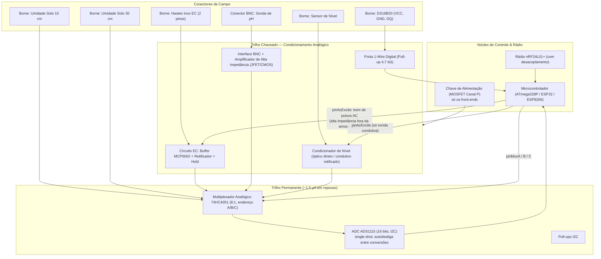

# Família de Sensores de Solo e Lisímetro Cerâmico: SU-xxT (Soil Unit)
## Manejo360 • Plataforma IoT de Monitoramento Agrícola e Fertirrigação

Este diretório contém a documentação técnica, especificações de hardware, esquema elétrico e diretrizes construtivas da família de sensores de solo modulares **SU-xxT** para integração ao ecossistema **Manejo360** (comunicação MySensors RF24 · Gateway MQTT · Node-RED).

---

## 1. Visão Geral e Conceito da Família SU

A linha **SU (Soil Unit)** foi concebida para atender diferentes níveis de complexidade no manejo agronômico a partir de **uma única placa de circuito impresso (PCB Universal SU)**. A diferenciação entre modelos ocorre unicamente pela população seletiva de componentes (estratégia DNI — *Do Not Install*) e pelas sondas externas conectadas.

### 1.1. Matriz de Modelos da Família SU

| Modelo | Umidade Solo (10 cm) | Umidade Solo (30 cm) | Condutividade Elétrica (EC) | pH da Solução | Temperatura Solo (T) | Nível da Câmara | Aplicação Principal |
|:---|:---:|:---:|:---:|:---:|:---:|:---:|:---|
| **SU-10** | Sim | Sim | — | — | — | — | Manejo hídrico básico em duas profundidades |
| **SU-10T** | Sim | Sim | — | — | Sim (DS18B20) | — | Manejo hídrico com termometria do solo |
| **SU-20** | Sim | Sim | Sim (Câmara) — ⚠️ indicativa | — | — | Sim | Tendência de salinidade, sem valor absoluto |
| **SU-20T** | Sim | Sim | Sim (Câmara) | — | Sim (DS18B20) | Sim | Hídrico + EC compensada termicamente (EC25) |
| **SU-30** | Sim | Sim | Sim (Câmara) — ⚠️ indicativa | Sim (Câmara) | — | Sim | Química da solução com EC apenas qualitativa |
| **SU-30T** | Sim | Sim | Sim (Câmara) | Sim (Câmara) | Sim (DS18B20) | Sim | **Topo de Linha:** Fertirrigação de precisão |

*Nota: O sufixo **'T'** indica a presença do sensor digital de temperatura do solo (`DS18B20`).*

> ⚠️ **EC sem termometria é indicativa, não quantitativa.** A condutividade tem
> coeficiente térmico de **1,91 %/°C**. Sem `DS18B20` não há `T_solo` para
> compensar, e os modelos `SU-20` e `SU-30` caem numa temperatura assumida de
> 25 °C — o que dá **~19 % de erro a cada 10 °C de desvio**. Solo de campo varia
> bem mais que isso ao longo do ano.
>
> O pH tolera melhor a mesma aproximação (~0,10 pH a 10 °C de desvio), então o
> `SU-30` continua útil para química da solução; é a **EC** dele que não sustenta
> valor absoluto.
>
> **Quem vai dosar fertirrigação pela EC precisa de modelo 'T'.** Para acompanhar
> apenas a *tendência* de salinização, os modelos sem termometria servem. Detalhe
> do cálculo e da tabela de erro no §6.

---

## 2. Disposição Física e Instalação em Campo

```
   SUPERFÍCIE DO SOLO
   =============================================================================
         |                     |
         | (Cabo Sonda 10cm)   | (Cabo DS18B20 Temp)
         v                     v
   [ 10 cm ] ----> Sonda Umidade 10 cm        [ DS18B20 ] (Temperatura da Rizosfera)
         |
         | (Cabo Sonda 30cm)
         v
   [ 30 cm ] ----> Sonda Umidade 30 cm
         |
         |
         v
   [ 30-40 cm ]  +----------------------------------------------------+
                 |            CÂMARA DO LISÍMETRO CERÂMICO            |
                 |                                                    |
                 |  • Sonda de pH Comercial BNC (Corpo Ø 12 mm)       |
                 |  • 2 Hastes de Inox 316 (Célula de EC da Solução)  |
                 |  • Sensor de Nível de Solução (Óptico IP68 / Inox) |
                 |                                                    |
                 |  ~~~~~~~~~~~~~~~~ Solução Filtrada ~~~~~~~~~~~~~~~ |
                 |====================================================|
                 |         PAREDE CERÂMICA MICROPOROSA INERTE         |
                 +----------------------------------------------------+
```

### 2.1. Sensor de Temperatura Externo
- O sensor **DS18B20** fica enterrado diretamente no solo (fora da câmara cerâmica).
- **Vantagens:** 
  1. Fornece a temperatura real da zona radicular (rizosfera).
  2. Compartilha o mesmo equilíbrio térmico com a solução dentro do lisímetro (devido ao contato íntimo da cerâmica com a terra).
  3. Descongestiona o espaço interno útil da cavidade cerâmica.

---

## 3. O Lisímetro Cerâmico DIY (Câmara de Extração de Solução)

A medição de **pH** e **EC da solução** é realizada no interior de uma câmara formada por uma **vela de filtro cerâmica porosa**.

```
                  ============[o]================== [Tampa com Rosca + Respiro]
                 |                                 |
                 |   [Sonda pH]   [Hastes EC]  [Sensor Nível]
                 |     (12mm)     (Inox 316)       |
                 |       ||           ||           |
                 |       ||           ||      +----+----+
                 |       ||           ||      | Prisma  | <-- Sensor Óptico IP68
                 |       ||           ||      | Óptico  |     (ou Pinos Inox 316)
                 |       ||           ||      +----+----+
                 |       ||           ||           |
                 |       ||           ||           |  <-- Limiar do Sensor de Nível
                 |       ||           ··           |      (acima da base das hastes)
                 |       ( )                       |
                 |     (Bulbo)                     |  <-- Reserva de Hidratação
                 |  ~~~~~~~~~~~~~~~~~~~~~~~~~~~~~  |      (zona selada, não drena)
                 |#################################|
                 |  ZONA SELADA (impermeabilização |
                 |   externa — sem filtração)      |
                 \                                 /
                  \_______________________________/
```

### 3.1. Diretriz Construtiva da Vela Cerâmica
- **Remoção de Aditivos:** Velas comerciais que contêm carvão ativado, prata coloidal ou esferas alcalinizantes **não podem ser usadas em seu estado original**, pois alteram artificialmente o pH e retêm íons da EC.
- **Preparação:** Utilizar velas de cerâmica branca tradicional simples **OU** abrir a base plástica da vela, remover integralmente o miolo de carvão/resinas e lavar a cavidade, mantendo **exclusivamente a parede cerâmica microporosa** como membrana filtrante inerte.

#### 3.1.1. Impermeabilização Externa da Base (Reserva de Hidratação)

A faixa **inferior** da vela recebe impermeabilização **externa**, convertendo aquele
trecho em poço não poroso. É o que garante que o bulbo de pH e a junção de
referência nunca fiquem secos — sem essa vedação o lisímetro é **bidirecional** e a
parede microporosa devolve o líquido ao solo assim que este seca. A parede porosa
segue sendo a única membrana filtrante na **zona ativa**, acima da vedação.

| Parâmetro | Diretriz |
|---|---|
| **Altura selada** | A **mínima** que submerja bulbo e junção de referência. Cada milímetro extra é área de extração perdida e volume estagnado ganho. **A definir por medição.** |
| **Selante** | Epóxi inerte com certificação para água potável. **Silicone acético está vetado** — libera ácido acético por semanas e acidifica a leitura de forma sistemática. |
| **Aplicação** | Cerâmica **completamente seca** antes da aplicação. Deslaminação parcial cria caminho preferencial de fluxo e é pior que não selar. |
| **Zona ativa** | As **hastes de EC permanecem acima da vedação**, na lâmina renovada. |

**Custo aceito — volume estagnado.** A reserva não se renova, e o bulbo de pH mede
justamente ela. Três mecanismos degradam essa água e todos enviesam a leitura:

- **Acúmulo de KCl** da junção de referência (todo eletrodo de gel selado vaza
  eletrólito lentamente) — **enviesa a EC para cima**, de forma progressiva.
- **Atividade microbiana** em água parada, escura e rica em nutrientes: CO2 → ácido
  carbônico → **pH deslocado para baixo**, mais incrustação sobre o vidro.
- **Estratificação:** as hastes de EC leem a lâmina superior renovada e o bulbo lê o
  fundo estagnado — pH e EC descrevem **águas diferentes** até a troca se completar.

A mitigação é de firmware: **descarte pós-reenchimento** (§3.3, Função 1).

#### 3.1.2. Respiro

A tampa possui **respiro**. Com vedação em cima e embaixo a câmara não troca ar e o
preenchimento por capilaridade trava por bolsão de ar — o sintoma seria
reenchimento lento, com o diagnóstico apontando erradamente para a área selada.
Executar por labirinto ou membrana hidrofóbica, de modo a ventilar sem admitir
água livre, solo ou raízes.

### 3.2. Sonda de pH BNC Comercial
- **Especificação:** Sonda padrão de laboratório/aquário com corpo em policarbonato (Ø 12 mm), bulbo de vidro sensível e referência Ag/AgCl em gel de KCl com conector BNC (ex: compatível com padrão AliExpress / E-201-BNC).
- **Preservação:** Por operar dentro de solução filtrada, o bulbo de vidro fica livre do atrito mecânico de pedras e areia, prolongando sua vida útil.

- **Modelo de sonda :** escolha o Modelo E201C (Eletrodo de pH com corpo de policarbonato Ø 12 mm, eletrólito em gel selado e conector BNC macho); O corpo é 100% selado, com eletrólito em gel. Não precisa de reposição de líquido e não tem tampa de abastecimento que possa vazar ou entrar água dentro do lisímetro/vela. 
Disponivel no https://pt.aliexpress.com/item/1005008843969615.html?spm=a2g0o.productlist.main.1.5178aIJvaIJvJa&algo_pvid=71820889-778b-4fbe-9d9e-5cc680b8720a&algo_exp_id=71820889-778b-4fbe-9d9e-5cc680b8720a-31&pdp_ext_f=%7B%22order%22%3A%22344%22%2C%22spu_best_type%22%3A%22price%22%2C%22eval%22%3A%221%22%2C%22fromPage%22%3A%22search%22%7D&pdp_npi=6%40dis%21BRL%2188.82%2144.41%21%21%21107.33%2153.66%21%402103081117887930418587641e0c77%2112000046918788200%21sea%21BR%216505659333%21X%211%210%21n_tag%3A-29919%3Bd%3A22586704%3Bm03_new_user%3A-29895&curPageLogUid=Uunecs3I4rD1&utparam-url=scene%3Asearch%7Cquery_from%3A%7Cx_object_id%3A1005008843969615%7C_p_origin_prod%3A

### 3.3. Sensor de Nível de Solução

O nível cumpre **duas funções distintas**: valida a metrologia de pH/EC e serve de
indicador agronômico de secagem do solo.

> **O nível tem três estados, não dois.** `Cheio`, `Seco` e **`Falha`**. Como
> `Seco` é publicado como alerta de irrigação (Função 2), tratar falha de
> instrumento como `Seco` transformaria um ADC mudo em recomendação de irrigar.
> Em `Falha` o nó **não publica** o child de nível nem pH/EC — a ausência do dado é
> diagnosticável pelo timeout do gateway; um `0` falso, não.

- **Função 1 — Validade metrológica:** com `Nivel = 0`, as leituras de pH e EC são
  marcadas como inválidas e descartadas pelo firmware, evitando o envio de ruído
  analógico.
  - **Como o descarte acontece de fato.** A biblioteca devolve uma sentinela
    (`SU_ERR_LEVEL_LOW`) e quem descarta é `M360Node::_readAndSendAll()`, cujo
    **único** filtro é `isnan(val) || val <= -32767.0f`
    ([`M360Node.cpp:249`](../../lib/M360-DRY/src/M360Node.cpp)). Por isso todas as
    sentinelas da `lib/SU-xxT` ficam **abaixo de −32767** — um valor "óbvio" como
    −999 atravessaria o filtro e apareceria no dashboard como `pH = -999.0`.
  - **Descarte pós-reenchimento.** A volta a `Nivel = 1` **não** revalida as leituras
    de imediato: a lâmina nova ainda não deslocou a reserva estagnada (§3.1.1).
    Exigir um número mínimo de **ciclos de amostragem consecutivos** com
    `Nivel = 1` (`minRechargeCycles`) antes de voltar a publicar pH e EC.
    - A contagem é **em ciclos, não em milissegundos**: `millis()` não avança
      durante `sleep()` / `smartSleep()` em AVR, então um temporizador em
      milissegundos jamais venceria — pH e EC nunca voltariam. O tempo efetivo é
      `minRechargeCycles × intervalo`, e o intervalo é ajustável em campo por
      `V_VAR1`.
    - **A definir por medição:** duração do tempo de troca, a converter em ciclos
      para o intervalo de operação escolhido.
- **Função 2 — Alerta de irrigação:** a câmara só esvazia quando o potencial
  matricial do solo cai abaixo da faixa de extração da parede cerâmica. `Nivel = 0`
  é, portanto, um sinal de solo seco e deve ser publicado como alerta, não apenas
  consumido internamente.
  - **Indicador corroborativo, não gatilho primário.** É binário e tardio frente
    às sondas de umidade, que são contínuas. Serve para confirmar déficit e como
    failsafe de sonda resistiva descalibrada — não para dimensionar lâmina.
  - **Exige janela de supressão pós-irrigação.** A cerâmica leva tempo para
    reencher depois que o solo é molhado, então `Nivel` permanece `0` durante e
    após o evento. Ligado cru ao motor de irrigação, o alerta se
    **auto-realimenta** e reirriga. **A definir:** tempo de reenchimento típico e
    duração da janela de supressão.

#### Geometria interna (decisão de projeto)

- O **bulbo de vidro da sonda de pH ocupa o ponto mais baixo da câmara**.
- O **sensor de nível fica posicionado acima do bulbo**, de modo que `Nivel = 0`
  seja disparado **enquanto ainda resta solução cobrindo o bulbo**. O volume entre o
  limiar do sensor e o fundo é a **reserva de hidratação**: mantém o vidro e a
  junção de referência molhados depois que as leituras já foram invalidadas. A
  reserva é **permanente** porque essa faixa da vela é impermeabilizada por fora
  (§3.1.1); sem a vedação ela drenaria sozinha pela cerâmica.
- Consequência para o limiar: as **hastes de EC são o elemento molhado mais raso**
  (pendem da tampa, acima do bulbo). O limiar do sensor de nível deve ficar
  **acima da extremidade inferior das hastes de EC**, senão haverá `Nivel = 1` com
  a célula de EC parcial ou totalmente fora da solução.

> **Fundo estanque — RESOLVIDO.** A reserva de hidratação é delimitada pela
> **impermeabilização externa da base da vela** (§3.1.1), não pela base plástica
> original. A parede porosa deixa de drenar a reserva de volta ao solo e o bulbo
> permanece submerso de forma permanente. Em contrapartida, a reserva passa a ser
> **volume estagnado** — ver o custo aceito e a mitigação em §3.1.1.
>
> **Ainda a definir por medição:** altura da faixa selada, altura do limiar do sensor
> de nível e volume resultante da reserva.

- **Sensores Recomendados:**
  - *Opção A (Industrial/Óptica):* Sensor de nível infravermelho miniatura IP68
    (FS-IR02 / XKC-001A) com rosca M10/M12. Saída digital — lida direto no canal 2
    do MUX, sem excitação.
  - *Opção B (DIY Condutiva):* 2 pequenos pinos de inox 316 fixados na tampa, com
    **excitação AC gerada pelo MCU** (`pinAcExcite`), reusando a cadeia da EC:
    trem de pulsos → buffer/retificador → envelope → ADS1115.

> **Sonda condutiva nunca é polarizada em DC.** Um limiar lido em DC sobre hastes
> de inox 316 **dentro** da câmara eletrolisa o eletrodo e contamina exatamente a
> solução que o lisímetro existe para medir — contra a premissa de parede filtrante
> inerte (§3.1), com deriva progressiva e silenciosa em pH e EC. A excitação é
> alternada e existe **apenas** durante a amostragem; fora dela o pino fica em alta
> impedância.
>
> **Os 10 ms são da excitação, não da conversão.** O ADS1115 converte o envelope já
> retificado — sinal quase-DC — então o teto de 128 SPS do ADC não limita nada
> aqui. O que precisa ser rápido é a rajada de pulsos, gerada por GPIO.

---

## 4. Arquitetura da PCB Universal SU



### Partição de trilhos

**O MOSFET chaveia apenas os front-ends analógicos.** ADS1115, 74HC4051 e os
pull-ups I2C ficam no trilho permanente: em single-shot o ADS1115 se autodesliga
entre conversões (~0,5 µA) e o 4051 fica na casa de 1 µA — desprezível frente ao
consumo do nó dormindo.

| Trilho | O que fica | Consumo em repouso |
|---|---|---|
| **Permanente** | ADS1115, 74HC4051, pull-ups I2C | ~1,5 µA |
| **Chaveado (MOSFET canal P)** | Front-ends de EC, pH e nível; sondas de umidade; DS18B20 | 0 µA |

Duas armadilhas que essa partição evita:

- **Perda de configuração.** No trilho chaveado, o ADS1115 voltaria a cada ciclo
  com o registrador de configuração no default, descartando em silêncio o ganho por
  canal do §4.1. (O firmware reaplica a configuração mesmo assim, por robustez.)
- **Pull-up contra escravo despotencializado.** Pull-ups I2C vivos sobre um ADS
  sem alimentação injetam corrente pelos diodos de proteção — consumo parasita e
  alimentação fantasma do CI.

> ⚠️ **Contrapartida: entradas do MUX não podem flutuar.** Com o trilho chaveado
> desligado, as cinco entradas do 4051 ficam sem fonte, e entrada CMOS flutuando
> consome e oscila. Prever pull-down alto em cada canal de entrada.

**A excitação AC é gerada pelo MCU, não pela PCB.** O front-end faz buffer,
retificação e hold; quem dispara o trem de pulsos é o firmware, por `pinAcExcite`.
Duas consequências de projeto:

- Frequência e número de pulsos (`acExciteHz`, `acExcitePulses`) são **parâmetros de
  calibração**, ajustáveis em campo sem trocar componente.
- Fora da janela de amostragem o pino fica em **alta impedância**. Não existe
  polarização contínua sobre as hastes de inox — é o que impede a eletrólise que
  contaminaria a solução medida (§3.3, Opção B).

### 4.1. Gestão dos Canais Analógicos

Multiplexador **`74HC4051`** (8:1 single-ended, endereçado por três linhas
`A`/`B`/`C`), com a saída comum ligada a **uma** entrada single-ended do `ADS1115`:

- **Canal 0:** Umidade do solo a 10 cm (0 a 3,3 V)
- **Canal 1:** Umidade do solo a 30 cm (0 a 3,3 V)
- **Canal 2:** Nível da câmara do lisímetro — saída digital direta (Opção A,
  óptica) ou envelope retificado da excitação AC (Opção B, condutiva)
- **Canal 3:** Condutividade elétrica aparente / solução (envelope retificado da
  excitação AC)
- **Canal 4:** Tensão do módulo de pH (Offset ~1,65 V ou ~2,5 V)
- **Canais 5 a 7:** livres — reservados para expansão (ORP, segunda célula de EC)
- **Porta Digital:** Barramento 1-Wire para o sensor DS18B20 (fora do MUX)

> **Por que 4051 e não 4052/4053.** São **cinco** canais analógicos, e duas linhas
> de endereço só alcançam quatro. O `74HC4052` é um duplo 4:1 (4 canais por banco,
> endereço A/B compartilhado) e o `74HC4053` é um triplo SPDT com três seletores
> independentes — nenhum dos dois endereça cinco canais por A/B. O 4051 resolve com
> um pino de MCU a mais e ainda deixa três canais livres.
>
> **Numeração:** os números acima são **canais físicos do MUX**, fixos pelo cobre da
> PCB. Não confundir com os *child IDs* do §5 (contrato MySensors) nem com o índice
> de enumeração da biblioteca, que varia conforme o modelo populado.
>
> **Acomodação:** prever tempo de estabilização entre a troca de canal e a conversão
> do `ADS1115` — sondas de alta impedância (pH) exigem mais. **A definir por
> medição.**

---

## 5. Mapeamento MySensors e Inventário Manejo360

Contrato de dados alinhado aos padrões do projeto (`inventario.md`):

Contrato de dados alinhado aos padrões do projeto (`inventario.md`). Estes são os
itens declarados em `NODE_ITEMS[]` — a faixa válida de child ID é **1 a 252**
(`inventario.md` §2):

| Child ID | Label | Tipo MySensors (`S_*`) | Tipo Variável (`V_*`) | Unidade | Variantes Ativas |
|:---:|---|---|---|:---:|---|
| `1` | `umidade_10cm` | `S_HUM` | `V_HUM` | `%` | Todos |
| `2` | `umidade_30cm` | `S_HUM` | `V_HUM` | `%` | Todos |
| `3` | `temp_solo` | `S_TEMP` | `V_TEMP` | `°C` | Modelos **'T'** (`SU-10T`, `SU-20T`, `SU-30T`) |
| `4` | `ec_solucao` | `S_WATER_QUALITY` | `V_EC` | `µS/cm` | `SU-20`, `SU-20T`, `SU-30`, `SU-30T` |
| `5` | `ph_solucao` | `S_WATER_QUALITY` | `V_PH` | `pH` | `SU-30`, `SU-30T` |
| `6` | `nivel_lisimetro` | `S_BINARY` | `V_STATUS` | `0/1` | `SU-20(T)`, `SU-30(T)` |

> **Child ID começa em 1.** A versão anterior desta tabela abria em `0`, fora da
> faixa 1–252 definida pelo `inventario.md`. A numeração 1–6 segue o padrão dos
> nós 1 e 2 da Horta.
>
> **Child IDs 253, 254 e 255 não entram na tabela nem no `NODE_ITEMS[]`.** São
> criados automaticamente por `M360Node::begin()` em todo nó que usa a lib
> (`inventario.md` §3): `253` debug remoto (`V_TEXT`), `254` intervalo de reporte
> (`V_VAR1`), `255` tensão da bateria (`V_VOLTAGE`). Declará-los manualmente
> duplica os children. É por isso que o buffer é `MyMessage[NODE_ITEMS_COUNT + 3]`.
>
> **EC usa o tipo nativo `V_EC` (53) sob `S_WATER_QUALITY`**, e não
> `S_CUSTOM`/`V_VAR2`. O par nativo carrega unidade e semântica em qualquer
> controlador; `V_VAR2` obrigaria todo consumidor a jusante a conhecer a convenção
> de cor. A unidade nativa do MySensors para `V_EC` é **µS/cm** — a conversão a
> partir de mS/cm é responsabilidade do firmware, não do Node-RED.
>
> **Ainda não é contrato vigente.** Nenhum nó SU existe na rede. Ao gravar o
> primeiro, estas linhas têm que ser replicadas em `src/DRY/horta/inventario.md`,
> e os consumidores em `flows.json` / `funcionalidades_nodered.md` atualizados na
> mesma entrega — ver `CLAUDE.md`.

---

## 6. Fluxo de Amostragem do Firmware (Low-Power)

1. **Acordar do Deep Sleep:** Acionamento periódico configurável via `V_VAR1` (ex: a cada 15 a 30 minutos).
2. **Ligar Barramento Analógico:** MOSFET liga o `VCC` dos front-ends e sondas
   (ADS1115 e MUX já estão no trilho permanente — §4). Aguarda o warm-up e reaplica
   a configuração do ADS1115.
3. **Amostragem de Nível:** seleciona o canal 2 do MUX. Com sonda óptica (Opção A)
   lê direto; com sonda condutiva (Opção B) dispara antes o trem de pulsos em
   `pinAcExcite` e amostra o envelope retificado. Aplica `levelThresholdAdc`.
   - Se `Nivel == 0` (reserva de hidratação): Lê apenas umidade 10 cm, 30 cm e
     temperatura. Zera o contador de recarga e devolve `SU_ERR_LEVEL_LOW` em pH e
     EC — sentinela abaixo de −32767, descartada pelo motor (§3.3, Função 1) —
     **e publica o alerta de secagem** (§3.3, Função 2). Acumula horas-em-seco para
     diagnóstico de vida útil da sonda de pH.
   - Se a leitura de nível **falhar** (ADC mudo, canal fora de faixa): devolve
     `SU_ERR_ADC_FAULT` em pH, EC **e no próprio child de nível**. Nada é
     publicado — o nó cala em vez de afirmar solo seco.
   - Se `Nivel == 1` (câmara preenchida):
     - Incrementa o contador de recarga. Enquanto
       `contador < minRechargeCycles`, pH e EC devolvem `SU_ERR_STALE_RECHARGE` e
       seguem descartados: a reserva estagnada ainda não foi trocada (§3.1.1).
     - Amostra Umidade (10 cm e 30 cm).
     - Seleciona o canal 3, dispara o trem de pulsos AC em `pinAcExcite` e amostra
       o envelope retificado da EC.
     - Amostra a tensão da sonda de pH.
     - Lê a temperatura do solo no DS18B20.
4. **Cálculos e Compensação:**
   - Aplica compensação de temperatura na EC: `EC_25 = EC_raw / (1 + α · (T_solo - 25,0))`
   - Aplica compensação de temperatura no pH, em três passos. O slope de Nernst
     `S_nernst(T) = 0,05916 · (T + 273,15) / 298,15` **não** multiplica direto a
     leitura: ele serve para separar a eficiência do eletrodo da temperatura.
     1. Slope empírico por segmento, da calibração de 3 pontos:
        `S_acid = (V_pH4 - V_pH7) / 3` e `S_alk = (V_pH7 - V_pH10) / 3`
     2. Eficiência do eletrodo, adimensional e independente da temperatura:
        `eff = S_segmento / S_nernst(T_calibração)`
     3. Leitura, escolhendo o segmento pela comparação de `V` com `V_pH7`:
        `pH = 7 + (V_pH7 - V) / (eff · S_nernst(T_solo))`

> **A temperatura da calibração tem que ser registrada.** Sem ela o passo 2 não
> existe e o slope medido em campo acaba multiplicado pelo fator de Nernst cru —
> **dupla compensação**, com erro que cresce junto com o desvio térmico. O campo
> `calibTempC` da `SU_CalibrationData` guarda esse dado.
>
> **Premissa:** `V_pH7` é o ponto isopotencial e é tratado como independente da
> temperatura. Simplificação usual, boa perto de pH 7 e pior nos extremos.
>
> **Modelos sem DS18B20 (`SU-20`, `SU-30`) não têm `T_solo`.** Ambas as
> compensações caem numa temperatura assumida (`assumedTempC`, padrão 25 °C). O
> custo é assimétrico e decide a escolha de modelo:
>
> | Grandeza | Sensibilidade | Erro a 10 °C de desvio |
> |---|---|---|
> | pH | slope varia ~0,34 %/10 °C | ~0,10 pH a 3 unidades do neutro |
> | EC25 | `α` = 1,91 %/°C | **~19 %** |
>
> Solo de campo varia bem mais que 10 °C ao longo do ano: **EC confiável exige
> modelo 'T'**. Nos modelos sem termometria a EC é indicativa, não quantitativa.
5. **Desligar Sensores:** MOSFET corta a alimentação dos front-ends analógicos
   (`0 µA` residual no trilho chaveado; ~1,5 µA no permanente, do ADS1115 em
   autodesligamento e do MUX).
6. **Transmissão e Sono:** Envia o pacote MySensors via rádio RF24 para o Gateway MQTT e retorna ao modo de baixo consumo.
