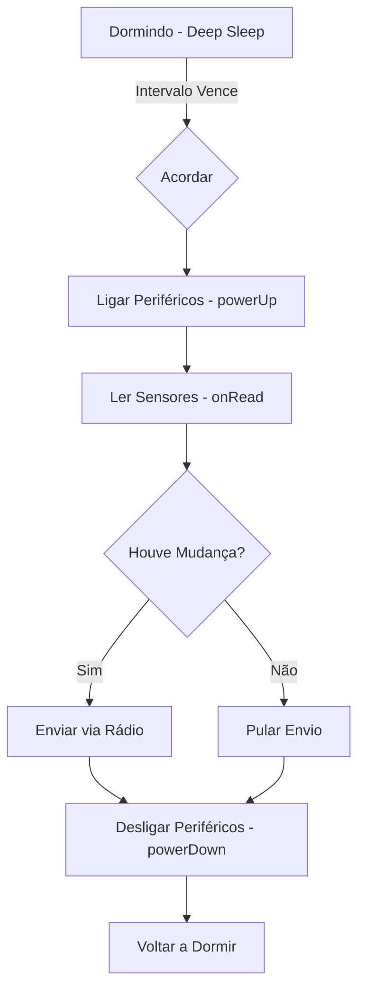

# LibDRY Framework — M360 Horta 🌿

Olá! Boas-vindas à **LibDRY (M360-DRY)**. Se você está aqui, é porque quer construir um nó para a rede M360 Horta que seja robusto, econômico e fácil de manter.

## 💡 A Analogia: "O Motor e o Piloto"

Para entender a LibDRY, pense em um **carro de corrida**:
- **O Piloto (Seu Nó):** Você decide para onde o carro vai. Você sabe qual sensor ler e qual relé acionar.
- **O Motor (LibDRY):** Ela cuida de tudo o que é "chato" e repetitivo: trocar as marchas (comunicação MySensors), economizar combustível (gestão de bateria e sleep) e garantir que o carro não quebre (buffers de memória seguros).

Com a LibDRY, você não precisa se preocupar com *como* enviar uma mensagem ou *como* fazer o rádio dormir. Você foca no seu sensor, e a biblioteca cuida do ecossistema.

---

## 🏗️ Arquitetura de Desacoplamento

A LibDRY separa o firmware em dois domínios para que você nunca precise repetir código:

1. **O Nó (O que ele é):** Define Child IDs, Labels e o perfil de energia (Bateria vs Fonte).
2. **O Driver (O que ele faz):** Implementa o acesso real aos pinos e sensores através de *callbacks*.

---

## 🔄 Fluxo de Trabalho (Ciclo de Vida)

Veja como a LibDRY orquestra o funcionamento de um nó típico de bateria:



---

## 🚀 Como Começar (Guia Rápido)

### 1. Defina o DNA do seu Nó
Crie um array `NODE_ITEMS` com os sensores e atuadores. Isso é o que o gateway verá.

```cpp
static const M360::M360ItemDef NODE_ITEMS[] = {
    // ID | Tipo            | Present | Value   | Pin | Smp | Label   | Wake | Flags
    { 0, M360_SENSOR,   S_HUM,    V_HUM,    A0,   5,  "Umidade", false, 0 }
};
```

### 2. Conecte os Cabos (Callbacks)
A LibDRY chamará sua função quando precisar de um dado:

```cpp
float meuLeitor(uint8_t index) {
    if (index == 0) return analogRead(A0);
    return NAN;
}

void setup() {
    node.onRead(meuLeitor);
    node.begin("Meu No", "1.0");
}
```

---

## 📚 Documentação Detalhada

Para mergulhar fundo nas engrenagens, consulte:

- 🏗️ [**Arquitetura Interna**](ARCHITECTURE.md) — Como o motor funciona por dentro.
- 📖 [**Referência da API**](API_REFERENCE.md) — Dicionário técnico de funções e structs.
- ⚡ [**Gestão de Energia**](ARCHITECTURE.md#gestão-de-energia) — Detalhes sobre os perfis LP, ON e PAS.

---
*Desenvolvido com ❤️ para a M360 Horta por Marcelo e Paige.*
