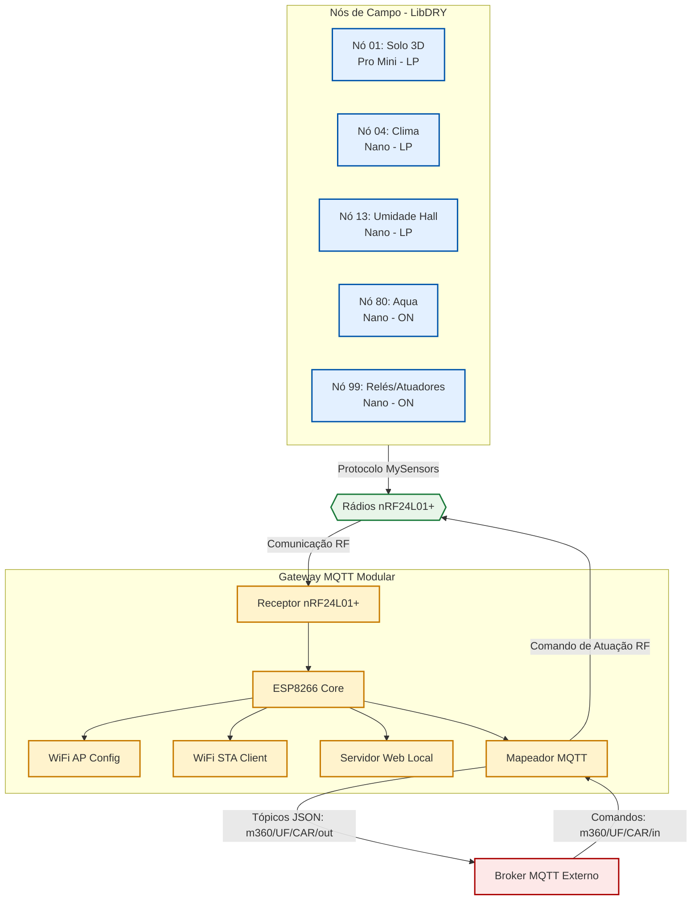

# Ecossistema M360 Horta — Arquitetura DRY (Don't Repeat Yourself)

Este diretório contém a especificação e o código fonte modularizado dos nós sensores, atuadores e do gateway central que compõem a rede de automação da **M360 Horta**. Todo o ecossistema é construído com base na biblioteca **[LibDRY](file:///c:/Users/jmarc/Documents/PlatformIO/Projects/m360_horta/lib/M360-DRY/)** e no protocolo **MySensors (v2.x)**, rodando em rádio **nRF24L01+**.

---

## 🏗️ Visão Geral da Arquitetura

O ecossistema divide-se em duas grandes camadas físicas e lógicas: os **Nós de Campo** e o **Gateway Central**. Toda a lógica repetitiva (configuração do rádio, reporte baseado em variação, controle de energia/sleep e leitura de bateria) é delegada a um motor compartilhado chamado **Node Engine**.



---

## 📁 Estrutura de Diretórios

O diretório `src/DRY/` está estruturado seguindo os princípios de reuso de código e modularidade:

```text
src/DRY/
├── README.md                 # Esta documentação geral
├── gateway/                  # Firmware e módulos do Gateway MQTT
│   ├── ngm/                  # Próxima Geração de Módulos (Next Gen MQTT)
│   │   ├── config_utils      # EEPROM (512+), CRC e DeviceConfig
│   │   ├── wifi_utils        # WiFi Config AP e Conexão STA
│   │   ├── mqtt_utils        # Broker, Tradutor JSON, Métricas
│   │   ├── webserver         # Portal Web de Configuração
│   │   └── leds              # Sinalizações RGB / Status do Sistema
│   └── withLibDRY/           # Implementação com a biblioteca gateway M360
│       └── libDryGatewayMqtt.cpp
│
└── nos/                      # Firmware e especificações dos Nós de Campo
    ├── shared/               # [CAMADA 1] Motor compartilhado de todos os nós
    │   ├── README.md         # Documentação detalhada do Node Engine
    │   ├── config.h          # Configurações globais e Child IDs fixos
    │   ├── node_engine.h/cpp # Motor declarativo dos sensores e atuadores
    │   └── powerProfile.h/cpp# Gestão dos perfis de energia (Low Power/Always On)
    │
    ├── 01nodeSolo3d/         # Nó 01: Monitoramento 3D de Solo (18 Sensores)
    ├── 04nodeClima/          # Nó 04: Monitoramento de Clima Estufa
    ├── 13nodeZTS_UmidadeHall/# Nó 13: Sensor ZTS de Umidade no Hall
    ├── 80nodeAqua/           # Nó 80: Parâmetros de Caixa de Água (pH, EC, Vazão)
    └── 99nodeReles/          # Nó 99: Quadro Central de Relés e Atuação Estufa
```

---

## ⚡ Perfis de Energia (`M360PowerProfile`)

O comportamento energético e a latência de comunicação de cada nó são definidos pelo seu perfil de energia de acordo com a fonte de alimentação disponível:

| Perfil | Sigla | Modo de Rádio | Comportamento | Fonte de Energia | Aplicação Típica |
| :--- | :--- | :--- | :--- | :--- | :--- |
| **`ALWAYS_ON`** | **`[ON]`** | Sempre Ativo | Escuta de rádio contínua. Latência de atuação `< 10ms`. | Fonte Fixa (12V/5V DC) | Atuadores (Nó 99) e leituras ininterruptas (Nó 80). |
| **`LOW_POWER`** | **`[LP]`** | Baixa Energia | Dorme em repouso absoluto. Acorda proativamente por Watchdog para ler e reportar. | Bateria / Solar | Sensores de campo distantes (Nó 01, Nó 04, Nó 13). |
| **`PASSIVE`** | **`[PAS]`** | Modo Passivo | Reativo. Utiliza o mecanismo `smartSleep` (Mailbox) para abrir janelas de escuta a cada intervalo. | Bateria de Alta Capacidade | Sensores pesados ou atuadores de bateria (Bomba). |

> [!NOTE]
> Para nós baseados em baterias Li-ion/LiPo, o motor compartilhado monitora a tensão na linha de alimentação e traduz linearmente de **3.0V (0%)** a **4.2V (100%)**, reportando automaticamente no **Child ID 255** a cada ciclo.

---

## 🔌 Nós de Campo em Detalhe

Cada nó de campo utiliza a estrutura de desenvolvimento padrão LibDRY:
- **`sensorDrivers.h/cpp`**: Camada física de driver que realiza as leituras brutas de hardware.
- **`withLibDRY/noX.cpp`**: Ponto de entrada do sketch que configura a lista de sensores e delega as chamadas ao motor.

### 🟢 [Nó 01: Monitoramento 3D da Umidade do Solo](file:///c:/Users/jmarc/Documents/PlatformIO/Projects/m360_horta/src/DRY/nos/01nodeSolo3d/) `[LP]`
*   **Hardware:** Arduino Pro Mini (3.3V / 8MHz) + Multiplexador CD74HC4067.
*   **Sensores:** 18 eletrodos resistivos instalados verticalmente no perfil de solo.
*   **Estratégias DRY:**
    *   **Mitigação de Eletrólise:** O pino digital `D3` chaveia a alimentação da barra de resistores através da rotina `powerUp()`/`powerDown()`, eliminando corrente galvânica pelo solo durante o sono profundo.
    *   **Estabilização Elétrica:** Adota delay de 20ms pós power-up, 5ms pós comutação de canal e *dummy read* no ADC para descarregar o capacitor interno.

### 🟢 [Nó 04: Monitoramento de Clima](file:///c:/Users/jmarc/Documents/PlatformIO/Projects/m360_horta/src/DRY/nos/04nodeClima/) `[LP]`
*   **Hardware:** Arduino Nano (ATmega328P) com adaptador regulado 3.3V para o rádio.
*   **Sensores:** Temperatura ambiente, umidade relativa do ar e radiação solar na estufa.

### 🟢 [Nó 13: Sensor Multiparametros](file:///c:/Users/jmarc/Documents/PlatformIO/Projects/m360_horta/src/DRY/nos/13nodeZTS_UmidadeHall/) `[LP]`
*   **Hardware:** Arduino Nano (ATmega328P).
*   **Sensores:** Sensores capacitivos de umidade do solo com compensação de histerese e calibração local.

### 🟢 [Nó 80: Monitoramento dHidroponia](file:///c:/Users/jmarc/Documents/PlatformIO/Projects/m360_horta/src/DRY/nos/80nodeAqua/) `[ON]`
*   **Hardware:** Arduino Nano (ATmega328P).
*   **Sensores:** pH (Condicionador pH-4502C), Condutividade Elétrica (EC), Temperatura da Água (DS18B20 OneWire), Nível da Caixa (Ultrassônico HC-SR04) e 4 sensores de vazão por contagem de pulsos (YF-S201).
*   **Estratégias DRY:**
    *   Leitura de Vazão controlada via interrupções de hardware externas (`INT0`, `INT1`) e interrupções por mudança de estado (`PCINT0`, `PCINT10`) para evitar qualquer perda de pulso de fluxo de água.
    *   Alimentação chaveada (`D7`) para as sondas de pH e EC, ativando-as 2 minutos antes e mantendo enquanto durar o bombeamento.

### 🟢 [Nó 99: Central de Atuadores da Estufa](file:///c:/Users/jmarc/Documents/PlatformIO/Projects/m360_horta/src/DRY/nos/99nodeReles/) `[ON]`
*   **Hardware:** Arduino Nano + Multiplexador CD74HC4067 + Módulos de Relés de Potência (Nativos e Multiplexados) + Tomadas de Serviço 220V.
*   **Atuadores/Sensores:**
    *   *Nativos:* Bomba NFT (220V - D2), Bomba Oxi (220V - D8), Temperatura/Umidade do painel (DHT11 - A0).
    *   *Multiplexados (MUX):* Solenoides de Irrigação (A, B, C), Bombas Peristáticas de pH+, pH- e Nutrientes.
*   **Estratégias DRY:**
    *   **Pinos Virtuais:** Mapeamento de pinos do MUX na faixa `100+` (`100` a `106`).
    *   **Concorrência Restrita:** O driver força por código que apenas um canal MUX fique ativo ao mesmo tempo, impedindo sobrecarga na fonte e transientes.
    *   **Fail-Safe:** Conexão nos bornes Normalmente Abertos (NA) de forma que falhas elétricas ou resets desenergizem as bobinas e desliguem todas as cargas.

---

## 🎛️ Gateway MySensors MQTT (Modular)

Localizado em **`src/DRY/gateway/`**, o gateway atua como a ponte inteligente entre a rede rádio local e o Broker MQTT central da infraestrutura Manejo360.

### 🔄 Tradução Bidirecional de Dados
1.  **Upstream (Rádio → MQTT):** Mensagens recebidas dos nós de campo são envelopadas em formato JSON e publicadas em `m360/{UF}/{CAR}/out`.
    *   *Formato do Payload:*
        ```json
        {
          "nodeId": 80,
          "sensorId": 1,
          "command": 1,
          "type": 0,
          "payload": "7.15",
          "timestamp": 1718972840
        }
        ```
2.  **Downstream (MQTT → Rádio):** O gateway assina o tópico `m360/{UF}/{CAR}/in` e recebe comandos em formato JSON, mapeando-os tanto em comandos MySensors brutos quanto em comandos amigáveis simplificados (ex: `"action": "PUMP_ON"`).

### 🛡️ Diagnóstico e Confiabilidade
*   **Rastreamento de Nós (Node Tracking):** O gateway mantém um registro local dos nós ativos. Caso um nó configurado fique sem se comunicar por mais de 5 minutos, publica um evento de alerta `node_lost` no tópico `{topic}/events`.
*   **Sinalização por LEDs:**
    *   *Verde Acesso:* Conexões WiFi e MQTT ativas e estáveis.
    *   *Amarelo Piscando:* WiFi OK, porém sem conexão com o Broker MQTT.
    *   *Vermelho Piscando:* Sem conexão WiFi local (modo de reconexão automática).
    *   *Flash de LED:* Indica tráfego de rádio de envio (Amarelo) ou recepção (Verde).

---

## 📜 Diretrizes e Checklist Anti-Padrões (Verificar antes de Commit)

Para manter a integridade conceitual do modelo DRY, todos os firmwares devem ser validados de acordo com o checklist abaixo:

*   [ ] ❌ **Não utilize `EEPROM.put()` diretamente nos sketches dos nós.** Toda alteração de intervalo ou estado dinâmico deve ser tratada através de `nodeEngine_saveInterval()`.
*   [ ] ❌ **Evite declarar macros do MySensors após incluir `<MySensors.h>`.** Definições como `MY_NODE_ID`, `MY_RADIO_RF24` e outras macros de configuração devem ser declaradas obrigatoriamente antes do include da biblioteca.
*   [ ] ❌ **Não misture ou use dois perfis de energia simultâneos.** Escolha unicamente entre `POWER_PROFILE_LOW_POWER` ou `ALWAYS_ON`.
*   [ ] ❌ **Nunca instancie strings de comando estáticas nos nós.** Sempre faça referência às constantes globais definidas em **[config.h](file:///c:/Users/jmarc/Documents/PlatformIO/Projects/m360_horta/src/DRY/nos/shared/config.h)** (como `CMD_FORCE_UPDATE`).
*   [ ] ❌ **Garanta o dimensionamento correto do array de mensagens.** O array de mensagens deve ter tamanho equivalente à quantidade de itens mais os canais especiais, por exemplo: `MyMessage messages[NODE_ITEMS_COUNT + 1]`.

---
> [!IMPORTANT]
> **Desenvolvimento Contínuo:** Para criar um novo nó respeitando os padrões de rádio, bateria e consistência do projeto M360 Horta, utilize o comando interativo do assistente `/m360-node-factory`.
