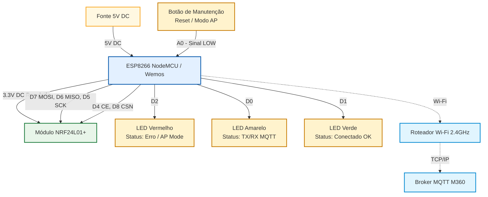

# Esquema Elétrico — Gateway MQTT (M360-DRY)

O diagrama a seguir detalha as conexões físicas e lógicas do **Gateway MQTT**, responsável por fazer a ponte de comunicação entre os nós sensores/atuadores da rede MySensors (via rádio NRF24L01) e o servidor central M360 (via rede Wi-Fi e MQTT).

## Diagrama de Conexões (Mermaid)

## Tabela de Pinagem (Pinout)

### NRF24L01 (Comunicação SPI)
| Pino Módulo | Pino NodeMCU (ESP8266) | Descrição |
| :--- | :--- | :--- |
| VCC | 3.3V | Alimentação estabilizada (Não usar 5V) |
| GND | GND | Referência de Terra |
| CE | D4 (GPIO2) | Chip Enable |
| CSN | D8 (GPIO15) | Chip Select Not |
| SCK | D5 (GPIO14) | Serial Clock (SPI Padrão) |
| MOSI | D7 (GPIO13) | Master Out Slave In (SPI Padrão) |
| MISO | D6 (GPIO12) | Master In Slave Out (SPI Padrão) |

### LEDs de Status
Acompanham o estado da conectividade do Gateway.
| Componente | Pino NodeMCU | Descrição |
| :--- | :--- | :--- |
| **LED Vermelho** | D2 (GPIO4) | Erro, Módulo sem WiFi ou Operando em Modo AP (Configuração) |
| **LED Amarelo** | D0 (GPIO16) | Transmitindo/Recebendo dados via MQTT ou Inicializando |
| **LED Verde** | D1 (GPIO5) | Conectado com sucesso (WiFi e MQTT OK) e rádio operante |

### Botão de Manutenção
| Componente | Pino NodeMCU | Descrição |
| :--- | :--- | :--- |
| **Botão (Push Button)** | A0 | Se pressionado no boot (ligado ao GND), força o NodeMCU a entrar em modo Access Point (AP) para reconfiguração das credenciais Wi-Fi e MQTT via Portal Cativo (192.168.4.1). |

---
**Nota:** A alimentação de 3.3V fornecida pelo próprio regulador linear da placa NodeMCU/Wemos geralmente é suficiente para o NRF24L01+ operando em modo baixo consumo (PA_LOW). Contudo, em caso de instabilidade ou se for utilizar um rádio NRF24L01+ PA/LNA (com antena externa e amplificador de potência), recomenda-se estritamente adicionar um módulo regulador/adaptador de tensão independente de 3.3V ligado diretamente à fonte de 5V.
