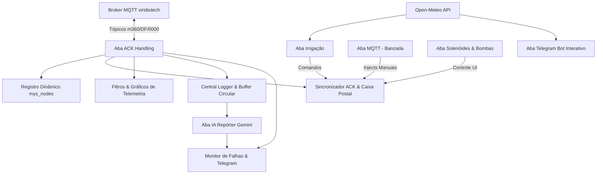

# PRD — Sistema de Automação e Supervisão Node-RED M360 Horta

## 1. Visão Geral do Produto e Objetivos Estratégicos

### 1.1 Contexto e Visão
O **M360 Horta** é um ecossistema IoT voltado para agricultura de precisão e cultivo protegido (hortas e hidroponia). O núcleo de supervisão, orquestração e inteligência agronômica é executado sobre a plataforma **Node-RED**, atuando como a ponte inteligente entre a rede de campo sem fio (baseada em nós sensores e atuadores Arduino/AVR com transceptores MySensors nRF24L01+ integrados via Gateway ESP8266 MQTT) e os usuários finais (produtores, agrônomos e operadores).

### 1.2 Objetivos do Produto
1. **Autonomia Agronômica:** Executar regras avançadas de irrigação que combinam leitura multiponto de solo, microclima interno e dados meteorológicos externos (evapotranspiração FAO-56 e déficit de pressão de vapor).
2. **Confiabilidade e Resiliência em Rádio:** Garantir que comandos críticos a relés e válvulas sejam entregues com confirmação real (ACK de aplicação), implementando retentativas exponenciais e fila de retenção assíncrona (**Caixa Postal / Mailbox**) para nós que operam em economia de energia (*Low Power*).
3. **Supervisão Contínua e Diagnóstico em Tempo Real:** Monitorar a saúde da rede, nós e gateway por meio de watchdog dinâmico, evitando falsos positivos e notificando anomalias de conectividade via Telegram com filtro anti-rajada.
4. **Inteligência Analítica e Relatórios:** Consolidar métricas operacionais diárias analisadas por modelo generativo de IA (Gemini) e fornecer bot interativo para consulta rápida.

---

## 2. Personas e Atores do Sistema

| Persona | Papel | Necessidades Principais | Interface Utilizada |
|---|---|---|---|
| **Produtor Rural / Agrônomo** | Gestão de cultivo e tomada de decisão agronômica | Monitorar umidade de solo em tempo real, acompanhar ciclos de rega, receber relatório diário com diagnósticos da estufa e alertas climáticos. | Telegram Bot (Boletins e Alertas) / Dashboard 2.0 (Gráficos) |
| **Operador Técnico / Integrador IoT** | Operação de campo, manutenção e parametrização | Acionar atuadores manualmente, ajustar cadência de envio de nós, verificar RSSI, status de baterias e logs brutos de MQTT. | Dashboard 2.0 (Controle Manual, Log MQTT, Watchdog) |
| **Agente de Campo (Firmware Gateway/Nós)** | Provedor de telemetria e executor de comandos | Receber comandos no formato estrito aceito pelo firmware, confirmar execução de relés, reportar leituras e baterias. | Protocolo MQTT / MySensors RF24 |

---

## 3. Arquitetura Funcional e Escopo

O sistema é estruturado em **7 abas modulares no Node-RED** alimentando uma interface em **Dashboard 2.0**:

---

## 4. Requisitos Funcionais (FR)

### Módulo 1: Ingestão, Decodificação e Registro de Nós

- **FR-01 (Normalização de Telemetria MySensors):** O sistema deve assinar o tópico MQTT `m360/+/+/out/#` e converter payloads binários e textos para um objeto unificado contendo `{nodeId, sensorId, command, ack, type, payload, direction, timestamp}`.
- **FR-02 (Diferenciação Estrita de ACK de Transporte vs Aplicação):** Mensagens recebidas com `ack === 1` devem ser categorizadas exclusivamente como `direction: 'transport_ack'` e **nunca** devem ser interpretadas como confirmação de estado de sensor ou atuação do nó.
- **FR-03 (Registro Dinâmico e Persistente `mys_nodes`):** O sistema deve manter um cadastro em tempo de execução de todos os nós ativos, populado exclusivamente pelas mensagens de apresentação (`C_PRESENTATION`) e telemetria recebida, persistido em armazenamento de arquivo (`file`) para sobrevivência a reinicializações.
- **FR-04 (Cálculo de Cadência e Timeout Dinâmico):** Para cada nó, o sistema deve registrar a cadência média observada (filtro IIR `0,7 * anterior + 0,3 * delta`) e calcular o timeout dinâmico de inatividade conforme a regra do firmware:
  $$\text{TimeoutSec} = \text{IntervalMin} \times 60 + \max(120, 0.5 \times \text{IntervalMin} \times 60)$$
- **FR-05 (Remapeamento Programático de Solo):** O sistema deve remapear o tipo `V_LEVEL` para `V_PERCENTAGE` quando o child foi registrado como `S_MOISTURE`, permitindo a compatibilidade transparente com nós de solo legados.
- **FR-06 (Expiração por TTL):** Nós sem nenhuma transmissão há mais de 48 horas (`nodes_ttl_ms = 172800000`) devem ser removidos automaticamente do registro `mys_nodes`.

---

### Módulo 2: Sincronização de Comandos, ACK e Caixa Postal (Low Power)

- **FR-07 (Serialização de Comandos com Retentativa Exponencial):** Comandos de escrita em atuadores (`command === 1 && type === 2`) devem ser enfileirados e despachados de forma serializada. Em caso de ausência de confirmação, o sistema deve retentar até 3 vezes (`ack_max_retries = 3`) com backoff exponencial ($5000 \times 2^{\text{tentativa}}\text{ ms}$).
- **FR-08 (Critério Rígido de Confirmação de Relé):** A confirmação de um comando de atuador deve exigir casamento exato de:
  - `nodeId == targetNode`
  - `sensorId == targetSensor`
  - `command === 1` (C_SET)
  - `type === 2` (V_STATUS)
  - `ack === 0` (eco de aplicação real do firmware)
  - `payload === currentItem.payload` (confirmação do valor solicitado, evitando falsos positivos de failsafe).
- **FR-09 (Caixa Postal para Nós Low Power):** Quando um comando for destinado a um nó classificado como `LOW_POWER` (sufixo `[LP]`, IDs 1, 2, 4 ou cadência $> 15\text{ s}$), se o nó não tiver transmitido nos últimos 2 segundos:
  - O comando deve ser retido em `global.m360_mailbox[nodeId]`.
  - O status visual deve reportar `mailbox_enqueued`.
  - Assim que o nó emitir qualquer pacote de telemetria, o comando retido deve ser despachado imediatamente na janela de recepção de ~3 segundos (`smartSleep`), reportando `mailbox_dispatched`.
- **FR-10 (Bypass para Comandos Não-Bloqueantes):** Comandos administrativos (`REPRESENT`, `FORCE_UPDATE`, `DEBUG_NET`) e comandos de configuração de intervalo (`child 254`, `V_VAR1`) não devem aguardar ACK síncrono de relé, sendo despachados imediatamente (ou enfileirados na Caixa Postal se o nó for LP).
- **FR-11 (Habilitação/Desabilitação de Sincronismo):** O operador deve poder ativar (`ENABLE_ACK_SYNC`) ou desativar (`DISABLE_ACK_SYNC`) o bloqueio síncrono de ACK via injeção de controle ou comando do fluxo.

---

### Módulo 3: Automação e Motor Agroclimático de Irrigação

- **FR-12 (Irrigação Canteiro A — Timer Fixo):** O sistema deve acionar o solenoide do Canteiro A (Nó 99, child 31) diariamente às **07:00** e **17:00** por um tempo padrão de 300 segundos, com desligamento garantido por `setTimeout` e notificação de início/fim via Telegram.
- **FR-13 (Irrigação Canteiro B — Coleta Agroclimática Open-Meteo):** A cada 30 minutos, o sistema deve consultar a API Open-Meteo para a coordenada $(-15.963944, -47.804028)$, extraindo ET₀, VPD, radiação solar instantânea, vento, ponto de orvalho e previsão de chuva em janela de 4 horas.
- **FR-14 (Irrigação Canteiro B — Motor de Regras em 5 Camadas):** A cada 5 minutos, o motor de irrigação deve avaliar a necessidade de rega no Canteiro B integrando os 6 pontos de umidade de solo (Nó 2), clima interno (Nó 99) e meteorologia externa conforme o pipeline:
  1. **Camada 1 (Soak Time):** Bloquear se a última rega ocorreu há menos de 15 minutos (20 minutos se temperatura $< 18^\circ\text{C}$).
  2. **Camada 2 (Sanitização e Mediana):** Filtrar apenas leituras válidas de solo dos últimos 30 minutos e calcular a mediana dos sensores.
  3. **Camada 3 (Condições de Standby e Proteção):**
     - *Capacidade de campo:* Mediana $< 350\text{ ADC} \implies$ Solo úmido (Standby).
     - *Chuva iminente:* Probabilidade $> 70\% \implies$ Bloquear rega (exceto se mediana $\ge 700\text{ ADC}$).
     - *Pico de radiação:* Radiação $> 700\text{ W/m}^2$ ou horário 12h–13h $\implies$ Bloquear rega (exceto se mediana $\ge 650\text{ ADC}$).
     - *Anti-fúngico noturno:* Horário 20h–05h com $(T - T_{\text{orvalho}}) < 1,5^\circ\text{C} \implies$ Bloquear rega (exceto se mediana $\ge 650\text{ ADC}$).
  4. **Camada 4 (Balanço Hídrico FAO-56):** Calcular lâmina de água necessária:
     $$\text{Lâmina (mm)} = \left(\frac{\text{Mediana} - 350}{500}\right) \times 3,5 \times F_{\text{atmo}} \quad (\text{teto } 4,5\text{ mm})$$
     $$F_{\text{atmo}} = 1,0 + (0,15 \text{ se } \text{VPD} > 1,8\text{ kPa}) + (0,10 \text{ se } \text{Vento} > 20\text{ km/h}) + (0,15 \text{ se } T > 25^\circ\text{C} \land \text{UR} < 18\%)$$
     $$\text{Volume (L)} = \text{Lâmina (mm)} \times 6,0\text{ m}^2$$
     $$\text{Duração (s)} = \frac{\text{Volume (L)}}{2,5 / 60} \quad (\text{cap máximo } 600\text{ s})$$
  5. **Camada 5 (Corte Mínimo):** Se a duração calculada for $\le 180\text{ s}$, abortar a rega para evitar micro-pulsos ineficientes.

---

### Módulo 4: Monitoramento, Watchdog e Alertas Telegram

- **FR-15 (Watchdog Periódico de Rede):** A cada 60 segundos, o sistema deve inspecionar `mys_nodes` e classificar o status de cada nó (`ONLINE`, `SEM HEARTBEAT`, `SEM ACK`, `OFFLINE`) com base no timeout dinâmico individual.
- **FR-16 (Watchdog do Gateway):** Se o gateway MQTT não publicar telemetria por mais de 120 segundos, o sistema deve registrar estado offline e alertar a equipe técnica.
- **FR-17 (Máquina de Estados Anti-Rajada de Alertas):** Alertas enviados ao Telegram devem respeitar limites de frequência por evento:
  - `node_lost`: Cooldown de 5 minutos.
  - `node_reconnected`: Cooldown de 2 minutos.
  - `node_sketch_name`: Cooldown de 30 segundos.
  - `ack_failure`: Cooldown de 60 segundos.
- **FR-18 (Confirmação de Aplicação em EEPROM):** Quando o nó ecoar seu valor de intervalo (`child 254`), o sistema deve verificar se houve alteração em relação a `last_param_values`. Em caso afirmativo, emitir notificação de confirmação de gravação na EEPROM.

---

### Módulo 5: Dashboard 2.0 e Registro Histórico

- **FR-19 (Controle Visual de Atuadores com Feedback Trifásico):** Os botões de atuação no dashboard devem exibir estados visuais em três fases:
  - *Amarelo:* Comando enviado / pendente de confirmação.
  - *Verde:* Execução confirmada pelo firmware com sucesso.
  - *Vermelho:* Falha de entrega ou timeout de retentativas.
- **FR-20 (Painel Administrativo de Comandos e Parametrização):** A interface deve permitir selecionar qualquer nó ativo via dropdown, escolher a ação (`Re-apresentar`, `FORCE_UPDATE`, `Debug da Rede`, `Definir Intervalo (1–1440 min)`) e despachar com um clique.
- **FR-21 (Gráficos de Telemetria com Retenção de 7 Dias):** O sistema deve manter séries temporais de até 3000 pontos (7 dias de retenção) para os 7 fluxos de monitoramento (Solo A, Solo B, Clima Nó 99, Clima Nó 04, Bateria Nó 04, Vazão e Volume Nó 99).
- **FR-22 (Replay de Gráficos Pós-Deploy):** Após qualquer novo deploy no Node-RED, os nós de replay devem reconstruir as séries gráficas a partir das variáveis de contexto de fluxo e histórico preservado.
- **FR-23 (Buffer Circular e Exportação CSV de Logs MQTT):** O sistema deve reter as últimas 6000 mensagens MQTT em memória (`global.mqtt_logs`), exibir as 100 mais recentes na UI com throttle de 800 ms, e disponibilizar endpoint `GET /api/mqtt-log/export` para download direto em CSV.

---

### Módulo 6: Inteligência Artificial (Gemini) e Bot Interativo

- **FR-24 (IA Repórter Diário):** Diariamente às **08:00**, o fluxo deve compilar os dados agregados das últimas 24 horas (totais de rega, volume de água, extremos de temperatura e umidade, eventos de perda e reconexão de nós, taxa de sucesso de comandos), formular um prompt de diagnóstico agronômico e submeter à API **Gemini 2.5 Flash**, distribuindo o relatório gerado a todos os inscritos do Telegram.
- **FR-25 (Bot Interativo e Boletim Meteorológico):** O bot de Telegram deve processar comandos dos usuários (`/start`, `/tempo`, `/previsao`, `/start convite`) e disparar boletins meteorológicos automáticos 4 vezes ao dia (06h, 11h, 16h, 21h).

---

## 5. Requisitos Não-Funcionais (NFR)

- **NFR-01 (Compatibilidade Rigorosa com Firmware MySensors):** Todo payload MQTT publicado para atuadores deve ser formatado estritamente como string literal (`String(payload)`), garantindo que a decodificação `atoi()` / `getBool()` no firmware funcione sem corrupção.
- **NFR-02 (Tolerância a Reinicializações):** A estrutura de nós cadastrados (`mys_nodes`) deve ser mantida em storage persistente em disco (`file`), evitando que um reboot do container/processo do Node-RED deixe o sistema sem os metadados dos nós antes de novas apresentações.
- **NFR-03 (Proteção contra Travamento de Interface):** Tabelas e gráficos no dashboard devem operar com throttling de atualização (mínimo de 800 ms no log MQTT) para não degradar o desempenho do navegador cliente.
- **NFR-04 (Segurança e Isolamento de Segredos):** Nenhuma chave de API ou credencial (Telegram Bot Token, Gemini API Key, Usuários) deve ser versionada em texto puro nos fluxos; tokens devem ser lidos exclusivamente via variáveis de ambiente (`env.get()`) ou contexto global.
- **NFR-05 (Tempo de Resposta em Nós Low Power):** Comandos retidos na Caixa Postal devem ser disparados em menos de 100 ms a partir da recepção do primeiro byte de telemetria do nó, aproveitando integralmente a janela de escuta de 3 segundos do rádio.

---

## 6. Matriz de Contratos e Mapeamento de Nós

| Nó | Nome/Função | Perfil | Child IDs | Protocolo / Tipos | Papel no Node-RED |
|:---:|---|:---:|---|---|---|
| **0** | Gateway MQTT ESP8266 | Always-On | Status / Eventos | `m360/DF/0000/out/#`, `.../events`, `.../gateway/status` | Ponte rádio ↔ MQTT, watchdog central |
| **1** | Solo 3D Canteiro A | Low Power | 1 a 6 (`S_MOISTURE`), 253, 254, 255 | `V_LEVEL` (ADC 0–1023) | Gráfico Solo A, monitoramento de umidade |
| **2** | Solo 3D Canteiro B | Low Power | 1 a 6 (`S_MOISTURE`), 253, 254, 255 | `V_LEVEL` (ADC 0–1023) | Gráfico Solo B, **Motor Agroclimático (Canteiro B)** |
| **4** | Clima SolarMini | Low Power | 1 (`S_TEMP`), 11 (`S_TEMP`), 12 (`S_HUM`), 255 | `V_TEMP` (°C), `V_HUM` (%), `V_VOLTAGE` (V) | Gráficos Clima e Bateria, Caixa Postal para Intervalo |
| **99** | Central de Relés & Sensores | Always-On | 11, 12 (`DHT11`), 21 (`YF-S201`), 31–39 (`Relés/Válvulas`) | `V_TEMP`, `V_HUM`, `V_FLOW`, `V_STATUS` | Execução de rega (31, 32), bombas (38, 39), Clima interno e Vazão |

---

## 7. Rastreabilidade e Manutenção

1. Este documento é o **contrato funcional primário** do Node-RED.
2. Qualquer alteração efetuada nos nós ou fluxos no servidor de produção (`https://nr.viridiotech.com.br`) via MCP deve ser refletida neste arquivo, no [`flows.json`](flows.json) e no [`funcionalidades_nodered.md`](funcionalidades_nodered.md).
