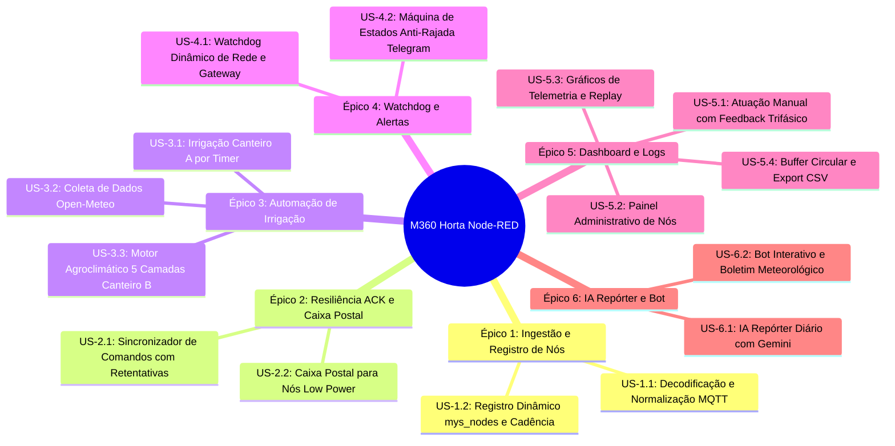

# Épicos e Histórias de Usuário — Sistema Node-RED M360 Horta

Este documento detalha a decomposição do [PRD (Product Requirements Document)](PRD_nodered.md) em **6 Épicos** e **15 Histórias de Usuário**, organizadas por valor de negócio e preparadas com critérios de aceitação rigorosos (formato BDD/Gherkin).

---

## 🗺️ Mapa de Rastreabilidade (PRD ↔ Épicos)

---

## Épico 1: Ingestão de Telemetria e Registro Dinâmico de Nós

### US-1.1: Decodificação e Normalização MySensors ↔ MQTT
- **Como** sistema central de automação,
- **Quero** receber e normalizar todas as publicações MQTT originadas pelo Gateway MySensors,
- **Para que** todas as camadas a jusante processem objetos estruturados com separação clara entre telemetria real e ACKs de transporte.

#### Critérios de Aceitação (BDD):
- **Cenário 1: Mensagem de sensor com telemetria legítima**
  - **Dado** uma publicação no tópico `m360/DF/0000/out/2/1/1/0/37` com payload `"450.0"`,
  - **Quando** o nó `Decodificador Nativo MySensors` processar a mensagem,
  - **Então** ele deve gerar um objeto com `nodeId: 2`, `sensorId: 1`, `command: 1`, `ack: 0`, `type: 37`, `payload: "450.0"` e `direction: 'sensor'`.
- **Cenário 2: ACK de rádio originado pelo gateway (Transport ACK)**
  - **Dado** uma mensagem recebida no tópico com o campo `ack === 1` (`m360/DF/0000/out/99/31/1/1/2`),
  - **Quando** o decodificador processar a mensagem,
  - **Então** ele deve classificar `direction: 'transport_ack'`,
  - **E** esta mensagem **não deve** atualizar o valor do atuador em `mys_nodes.values`.
- **Cenário 3: Remapeamento de sensores de solo legados**
  - **Dado** que o child foi registrado anteriormente como `S_MOISTURE`,
  - **Quando** o `Translator Json` processar uma leitura de tipo `V_LEVEL` (37),
  - **Então** ele deve interpretar a grandeza como percentual/nível de solo (`V_PERCENTAGE`) sem depender de verificação estática de `nodeId`.

---

### US-1.2: Registro Dinâmico `mys_nodes` e Rastreamento de Cadência
- **Como** operador e motor de regras,
- **Quero** manter um cadastro em tempo de execução dos nós, tipos de sensores, saúde de bateria e cadência observada,
- **Para que** a interface e os algoritmos se adaptem automaticamente aos nós presentes sem necessidade de hardcoding.

#### Critérios de Aceitação (BDD):
- **Cenário 1: Apresentação de novo nó**
  - **Dado** que o nó 4 envia mensagens `C_PRESENTATION` (command 0) com `S_TEMP` no child 11 e `I_SKETCH_NAME` `"04noodeSolarMini [LP]"`,
  - **Quando** o nó `Mapeia nós` processar os eventos,
  - **Então** `global.mys_nodes[4]` deve registrar os metadados dos sensores, o nome do sketch e a categoria `"Clima"`,
  - **E** persistir a estrutura no storage de arquivo (`file`).
- **Cenário 2: Cálculo de cadência observada**
  - **Dado** que um nó transmite com intervalo superior a 15 segundos,
  - **Quando** novos pacotes chegarem com espaçamento $\Delta t$,
  - **Então** a cadência `cycleMs` deve ser recalculada por filtro IIR: $\text{cycleMs}_{\text{novo}} = 0{,}7 \times \text{cycleMs}_{\text{ant}} + 0{,}3 \times \Delta t$.
- **Cenário 3: Expiração de nós inativos (TTL)**
  - **Dado** que um nó não emite transmissões há mais de 48 horas ($172.800.000\text{ ms}$),
  - **Quando** a rotina periódica `Limpeza TTL mys_nodes` executar a cada 300 segundos,
  - **Então** o registro do nó correspondente deve ser expurgado de `mys_nodes`.

---

## Épico 2: Resiliência de Comunicação, Sincronismo ACK e Caixa Postal

### US-2.1: Sincronizador de Comandos com Retentativas Exponenciais e Matching Estrito
- **Como** operador técnico ou automação de irrigação,
- **Quero** despachar comandos para relés e atuadores garantindo confirmação real de execução no hardware,
- **Para que** comandos perdidos no meio sem fio sejam retentados e falhas definitivas sejam imediatamente identificadas.

#### Critérios de Aceitação (BDD):
- **Cenário 1: Confirmação bem-sucedida de relé**
  - **Dado** que foi emitido o comando de ligar solenoide A (`nodeId: 99, sensorId: 31, payload: "1"`),
  - **Quando** o nó 99 responder com `nodeId: 99, sensorId: 31, command: 1, type: 2 (V_STATUS), ack: 0, payload: "1"`,
  - **Então** o `Sincronizador ACK` deve casar a confirmação, remover o comando da fila e emitir status `success`.
- **Cenário 2: Descarte de falso positivo por ACK de transporte**
  - **Dado** que o rádio gateway envia um salto com `ack === 1`,
  - **Quando** a mensagem passar pelo `Sincronizador ACK`,
  - **Então** ela deve ser ignorada para fins de confirmação de aplicação, mantendo o comando na fila de espera de confirmação do nó.
- **Cenário 3: Esgotamento de retentativas com backoff**
  - **Dado** que o nó 99 está fora do ar e um comando de relé é despachado,
  - **Quando** o timer atingir 5000 ms sem resposta,
  - **Então** o sincronizador deve retentar até 3 vezes duplicando o timeout ($5\text{s} \to 10\text{s} \to 20\text{s}$),
  - **E** após a 3ª falha, remover o item e emitir status `error` (timeout).

---

### US-2.2: Caixa Postal (Mailbox) para Nós Low Power com Janela de Despertar
- **Como** operador do sistema,
- **Quero** enviar comandos de parametrização (como alteração de intervalo) para nós a bateria (Low Power),
- **Para que** o comando não seja descartado durante a hibernação e seja entregue com precisão no instante em que o nó acordar.

#### Critérios de Aceitação (BDD):
- **Cenário 1: Retenção na Caixa Postal quando o nó está dormindo**
  - **Dado** que o nó 4 (SolarMini `[LP]`) transmitiu pela última vez há 10 minutos,
  - **Quando** o operador enviar o comando "Definir Intervalo = 30 min",
  - **Então** o sincronizador deve armazenar o comando em `global.m360_mailbox[4]`,
  - **E** emitir status `mailbox_enqueued`.
- **Cenário 2: Despacho imediato no despertar do nó**
  - **Dado** que existe um comando retido em `global.m360_mailbox[4]`,
  - **Quando** o nó 4 despertar e transmitir seu pacote de telemetria periódico,
  - **Então** o sistema deve publicar o comando retido no MQTT em $< 100\text{ ms}$, aproveitando a janela de escuta de 3 segundos (`smartSleep`),
  - **E** emitir status `mailbox_dispatched`.

---

## Épico 3: Automação Inteligente de Irrigação

### US-3.1: Irrigação Temporizada Canteiro A
- **Como** produtor da horta,
- **Quero** que o Canteiro A seja irrigado automaticamente nos horários convencionais pré-programados,
- **Para que** o cultivo tradicional de alface receba a lâmina básica sem falhas diárias.

#### Critérios de Aceitação (BDD):
- **Cenário 1: Disparo programado de rega**
  - **Dado** que o relógio do sistema atinge exatamente **07:00** ou **17:00**,
  - **Quando** o cron disparar o fluxo de Irrigação do Canteiro A,
  - **Então** o sistema deve publicar payload `"1"` para o child 31 do Nó 99,
  - **E** agendar o desligamento (payload `"0"`) para 300 segundos depois via `setTimeout`,
  - **E** enviar notificação de início e conclusão no Telegram.

---

### US-3.2: Coleta de Dados Agroclimáticos Open-Meteo
- **Como** motor de irrigação inteligente,
- **Quero** consultar periodicamente previsões meteorológicas e variáveis agronômicas de alta precisão,
- **Para que** o balanço hídrico considere chuva prevista, déficit de pressão de vapor e evapotranspiração.

#### Critérios de Aceitação (BDD):
- **Cenário 1: Coleta e cálculo de variáveis agroclimáticas**
  - **Dado** o intervalo de 30 minutos,
  - **Quando** a requisição HTTP para a API Open-Meteo for completada nas coordenadas $(-15.963944, -47.804028)$,
  - **Então** o nó `Processar Variáveis Agroclimáticas` deve calcular ET₀, VPD, radiação solar, vento e probabilidade máxima de chuva em janela de 4 horas,
  - **E** salvar os dados consolidados em `flow.agro_meteo`.

---

### US-3.3: Motor Agroclimático de Irrigação em 5 Camadas (Canteiro B)
- **Como** agrônomo responsável,
- **Quero** que a rega do Canteiro B seja decidida por um motor multicamada que previna doenças fúngicas, desperdício e estresse hídrico,
- **Para que** o manejo da água atinja máxima eficiência com base científica (FAO-56).

#### Critérios de Aceitação (BDD):
- **Cenário 1: Bloqueio por Soak Time (Camada 1)**
  - **Dado** que uma rega ocorreu há 10 minutos,
  - **Quando** o ciclo de avaliação de 5 minutos executar,
  - **Então** a rega deve ser abortada imediatamente aguardando o tempo de absorção (15 min normal / 20 min com $T < 18^\circ\text{C}$).
- **Cenário 2: Bloqueio por Capacidade de Campo (Camada 3.1)**
  - **Dado** que a mediana das leituras de solo válidas dos últimos 30 min é $< 350\text{ ADC}$,
  - **Quando** a Camada 3 for avaliada,
  - **Então** o motor deve definir status como `Standby (Solo Úmido)` e não abrir o solenoide.
- **Cenário 3: Bloqueio por Condições Adversas e Exceção de Estresse Crítico**
  - **Dado** que a probabilidade de chuva é $> 70\%$ ou a radiação solar instantânea é $> 700\text{ W/m}^2$,
  - **Quando** a mediana de solo for $< 650\text{ ADC}$,
  - **Então** a rega deve ser adiada;
  - **Mas se** a mediana for $\ge 700\text{ ADC}$ (estresse severo), a proteção deve ser sobreposta e a rega autorizada.
- **Cenário 4: Cálculo da Lâmina FAO-56 e Corte Mínimo (Camadas 4 e 5)**
  - **Dado** que todas as condições de proteção foram satisfeitas e a mediana de solo é $550\text{ ADC}$,
  - **Quando** o balanço hídrico for calculado,
  - **Então** o sistema deve aplicar o fator atmosférico $F_{\text{atmo}}$ sobre a lâmina de $6\text{ m}^2$,
  - **E se** a duração resultante for $\le 180\text{ s}$, abortar a rega (Camada 5);
  - **E se** for $> 180\text{ s}$, acionar o solenoide B (Nó 99, child 32) pelo tempo calculado (limitado ao cap de 600 segundos).

---

## Épico 4: Supervisão de Rede, Watchdog e Alertas Telegram

### US-4.1: Watchdog Dinâmico de Rede e Gateway
- **Como** integrador técnico,
- **Quero** que o sistema monitore continuamente a saúde de cada nó e do gateway através de timeouts adaptativos,
- **Para que** dispositivos inativos sejam detectados sem gerar falsos alarmes em nós com cadência longa.

#### Critérios de Aceitação (BDD):
- **Cenário 1: Detecção de nó offline com timeout adaptativo**
  - **Dado** que um nó possui intervalo configurado de 60 minutos ($\text{timeout} = 60 \times 60 + 1800 = 5400\text{ s}$),
  - **Quando** o watchdog avaliar o nó após 5500 segundos sem mensagens,
  - **Então** o nó deve ser classificado como `OFFLINE` na tabela de status da rede.
- **Cenário 2: Perda de comunicação do Gateway MQTT**
  - **Dado** que nenhuma mensagem de status ou telemetria é recebida do gateway há mais de 120 segundos,
  - **Quando** a rotina `Verifica Gateway Offline` executar,
  - **Então** deve ser gerado um alerta de `Gateway Offline` no sistema.

---

### US-4.2: Máquina de Estados Anti-Rajada de Alertas no Telegram
- **Como** usuário do canal de suporte no Telegram,
- **Quero** receber notificações claras de anomalias sem sofrer inundações de mensagens repetidas (spam/rajada),
- **Para que** a comunicação permaneça informativa e focada em eventos relevantes.

#### Critérios de Aceitação (BDD):
- **Cenário 1: Cooldown de perda de nó (`node_lost`)**
  - **Dado** que um alerta de `node_lost` para o Nó 1 foi emitido no Telegram há 2 minutos,
  - **Quando** uma nova condição de perda for disparada para o mesmo nó,
  - **Então** o `Monitor de Falhas` deve reter o envio respeitando a janela mínima de cooldown de 5 minutos.
- **Cenário 2: Notificação de gravação de parâmetro na EEPROM**
  - **Dado** que o operador enviou uma nova cadência para um nó,
  - **Quando** o nó responder com o eco do `child 254` refletindo o novo valor,
  - **Então** o sistema deve enviar a mensagem *"PARÂMETRO CONFIRMADO: Intervalo de Envio aplicado na EEPROM"*,
  - **E** suprimir alertas em transmissões futuras que mantiverem o mesmo valor.

---

## Épico 5: Visualização, Painel de Controle e Histórico no Dashboard 2.0

### US-5.1: Atuação Manual com Feedback Visual Trifásico
- **Como** operador de campo na estufa,
- **Quero** acionar botões de solenoides e bombas no Dashboard 2.0 e visualizar instantaneamente o status do comando,
- **Para que** eu tenha certeza absoluta se o comando foi enviado, confirmado pelo atuador ou falhou.

#### Critérios de Aceitação (BDD):
- **Cenário 1: Ciclo de feedback visual completo**
  - **Dado** que o operador clica no botão "Ligar Solenóide A",
  - **Quando** o clique ocorrer, o botão deve mudar imediatamente para a cor **amarela** (pendente),
  - **E quando** o retorno do nó confirmar a execução (`V_STATUS`), o botão deve mudar para a cor **verde** (confirmado),
  - **Ou se** ocorrer timeout de 3 retentativas, o botão deve mudar para a cor **vermelha** (erro).

---

### US-5.2: Painel Administrativo de Comandos e Parametrização
- **Como** técnico de manutenção,
- **Quero** selecionar nós dinamicamente em um dropdown e disparar ações administrativas ou ajustes de tempo,
- **Para que** eu possa calibrar e testar a rede em tempo real sem editar código de fluxo.

#### Critérios de Aceitação (BDD):
- **Cenário 1: População dinâmica do dropdown sem flickering**
  - **Dado** que novos nós entram na rede,
  - **Quando** `Atualiza Opções do Dropdown` processar `mys_nodes`,
  - **Então** a lista de opções do dropdown deve ser atualizada somente quando houver alteração de assinatura, evitando engasgos na UI.
- **Cenário 2: Envio de comandos de gestão**
  - **Dado** que o técnico seleciona o Nó 2, a ação `FORCE_UPDATE` e clica em "Enviar Comando",
  - **Quando** o processador tratar o evento,
  - **Então** deve publicar `m360/DF/0000/in/2/0/1/0/48` com payload `"FORCE_UPDATE"`.

---

### US-5.3: Gráficos de Telemetria com Retenção de 7 Dias e Replay pós-Deploy
- **Como** agrônomo,
- **Quero** visualizar séries temporais de 7 dias de solo, clima e hidrometria no dashboard,
- **Para que** os gráficos não fiquem vazios após uma reinicialização ou novo deploy de fluxos.

#### Critérios de Aceitação (BDD):
- **Cenário 1: Armazenamento contínuo de histórico**
  - **Dado** que chegam leituras dos sensores de solo dos nós 1 e 2,
  - **Quando** passarem pelos respectivos nós `Salvar Histórico`,
  - **Então** os pontos devem ser mantidos em memória de fluxo com janela deslizante de 7 dias (teto de 3000 pontos).
- **Cenário 2: Replay automático após deploy**
  - **Dado** que um operador realiza um deploy no Node-RED,
  - **Quando** o evento de inicialização ocorrer,
  - **Então** os nós `Replay Histórico Gráficos` devem reenviar imediatamente o histórico acumulado para alimentar os gráficos do Dashboard 2.0.

---

### US-5.4: Central Logger MQTT com Buffer Circular e Exportação CSV
- **Como** desenvolvedor/auditor de rede,
- **Quero** acessar o buffer das últimas mensagens MQTT e baixar o histórico em formato CSV,
- **Para que** eu possa auditar transações MySensors, investigar falhas de conectividade e analisar dados brutos.

#### Critérios de Aceitação (BDD):
- **Cenário 1: Retenção em buffer circular e throttle de visualização**
  - **Dado** tráfego contínuo de entrada e saída MQTT,
  - **Quando** o `Central Logger MQTT` processar as mensagens,
  - **Então** deve reter até 6000 mensagens em `global.mqtt_logs`,
  - **E** alimentar a tabela do dashboard com as 100 mensagens mais recentes aplicando throttle de 800 ms.
- **Cenário 2: Download do arquivo CSV**
  - **Dado** que o operador faz uma requisição `GET` para `/api/mqtt-log/export`,
  - **Quando** o endpoint responder,
  - **Então** deve retornar status 200 com cabeçalho `Content-Disposition: attachment; filename="mqtt_logs.csv"` contendo todas as mensagens tabuladas.

---

## Épico 6: Inteligência Artificial (Gemini) e Assistente Interativo

### US-6.1: IA Repórter Diário Agroclimático com Gemini 2.5 Flash
- **Como** produtor rural e gestor da estufa,
- **Quero** receber um relatório diário matinal sintetizado por inteligência artificial,
- **Para que** eu tenha um diagnóstico holístico do clima, volume de água aplicado, eficiência de rega e anomalias de rede das últimas 24 horas.

#### Critérios de Aceitação (BDD):
- **Cenário 1: Compilação de métricas e geração de diagnóstico**
  - **Dado** que o relógio atinge **08:00**,
  - **Quando** o fluxo `IA Repórter (Diário)` executar,
  - **Então** o nó `Radar M360` deve calcular o resumo estatístico das últimas 24 horas a partir de `mqtt_logs` e comparar com o dia anterior (`m360_daily_metrics_prev`),
  - **E** submeter o prompt contextualizado à API **Gemini 2.5 Flash**,
  - **E** transmitir a análise diagnóstica por Telegram a todos os inscritos cadastrados.

---

### US-6.2: Bot Telegram Interativo e Boletins Meteorológicos Periódicos
- **Como** usuário cadastrado no canal Telegram da horta,
- **Quero** interagir com o bot via comandos (`/tempo`, `/previsao`) e receber boletins meteorológicos automáticos,
- **Para que** eu possa acompanhar as condições microclimáticas em tempo real a qualquer momento.

#### Critérios de Aceitação (BDD):
- **Cenário 1: Resposta a comando `/tempo`**
  - **Dado** que um usuário envia `/tempo` no chat do bot,
  - **Quando** `Tratar Comandos e Convites Telegram` processar o texto,
  - **Então** deve responder com a temperatura e umidade atuais do ar (Nó 99 e Nó 04) e status de irrigação.
- **Cenário 2: Boletim meteorológico 4 vezes ao dia**
  - **Dado** que o relógio atinge os horários **06h, 11h, 16h ou 21h**,
  - **Quando** o cron de boletim disparar,
  - **Então** o sistema deve consultar a Open-Meteo e enviar a síntese de previsão climática para a lista de `global.telegram_subscribers`.
