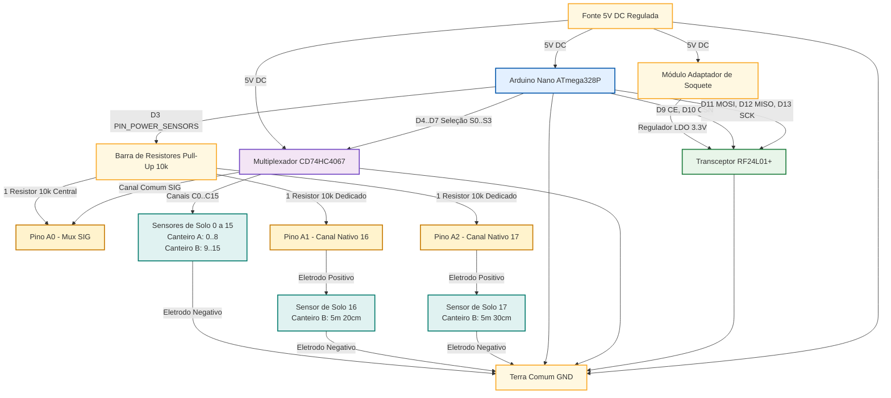

# Diagrama de Blocos — Nó 05 (Monitoramento 3D de Solo Unificado)

Este arquivo descreve a arquitetura de blocos funcionais do **Nó 05 (05nodeSolo3dNanoMux)**, detalhando o fluxo de alimentação, sinais de controle e leitura analógica.

## Arquitetura de Blocos (Mermaid)

---

## Descrição dos Blocos

1. **Alimentação:** A fonte primária de 5V alimenta diretamente o Arduino Nano e o circuito integrado multiplexador CD74HC4067. Para o rádio NRF24L01+, é empregado um módulo adaptador de soquete contendo um regulador de tensão linear (LDO) de 3.3V (AMS1117-3.3) para reduzir e estabilizar a tensão, eliminando ruídos da linha que degradam o tráfego RF.
2. **Mitigação de Eletrólise (Pino D3):** A alimentação dos resistores de pull-up é chaveada digitalmente pelo pino **D3** (`PIN_POWER_SENSORS`). Em repouso (entre leituras), este pino permanece em `LOW` (0V), extinguindo correntes galvânicas no solo para prolongar a vida útil dos eletrodos de aço inox dos sensores.
3. **Barra de Divisores de Tensão:**
   * **Canais do MUX (0 a 15):** Utiliza-se a configuração de pull-up único centralizado. Um único resistor de **10kΩ** conecta o barramento de alimentação de sensores (pino **D3**) diretamente ao pino comum de sinal do MUX (**A0/SIG**).
   * **Canais Nativos (16 e 17):** Como estes sinais não passam pelo chaveador do MUX, eles possuem resistores individuais de **10kΩ** ligados entre o pino **D3** e suas respectivas portas (**A1** e **A2**).
4. **Comutação Analógica:** O chip CD74HC4067 atua como uma chave seletora analógica de 16 posições. A MCU seleciona qual sensor do barramento deseja ler aplicando o código binário do canal (0 a 15) nos pinos seletores `S0-S3`. O sinal do sensor correspondente é fechado com o pino `SIG`, gerando a leitura do divisor de tensão através da porta analógica `A0`.
