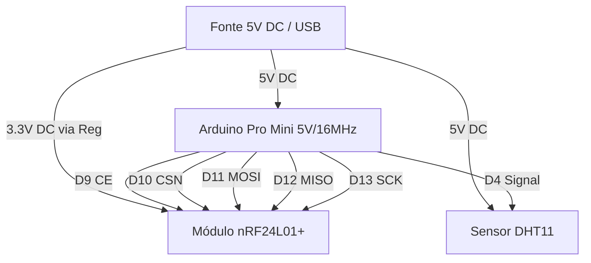

# Esquema Elétrico — miniDHT (Nó 11)

O diagrama a seguir detalha as conexões físicas e lógicas do **miniDHT** (Sub-projeto Kit Hélio), responsável por monitorar a temperatura e umidade relativa do ar.

## Diagrama de Conexões (Mermaid)

## Tabela de Pinagem

| Componente | Pino Arduino Pro Mini | Sinal / Função | Observação |
|---|---|---|---|
| **Módulo nRF24L01+** | D9 | CE | Habilitação do Rádio |
| **Módulo nRF24L01+** | D10 | CSN | Chip Select Not (SPI) |
| **Módulo nRF24L01+** | D11 | MOSI | Dados SPI |
| **Módulo nRF24L01+** | D12 | MISO | Dados SPI |
| **Módulo nRF24L01+** | D13 | SCK | Clock SPI |
| **Sensor DHT11** | D4 | Data | Leitura Digital (com resistor Pull-up 10k Ohm para 5V) |
| **Alimentação** | VCC / RAW | 5V DC | Entrada de energia contínua |
| **GND** | GND | GND | Terra comum |

## Tabela de Child IDs (MySensors)

| Child ID | Dispositivo | Tipo MySensors | Tipo de Dado | Função |
|---|---|---|---|---|
| 11 | DHT11 | S_TEMP | V_TEMP | Temperatura do ar (°C) |
| 12 | DHT11 | S_HUM | V_HUM | Umidade relativa do ar (%) |
| 254 | Interno | S_CUSTOM | V_VAR1 | Configuração de Intervalo |
