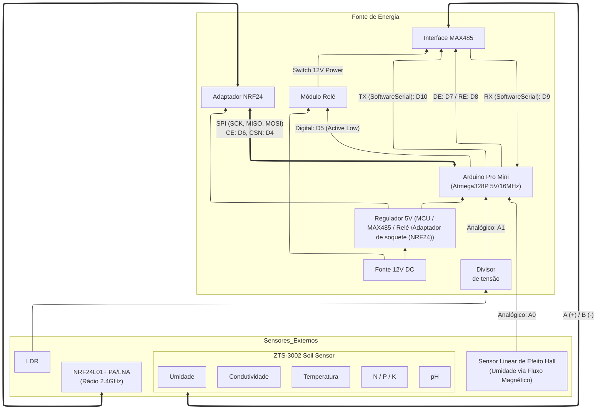

# Diagrama de Bloco: Nó ZTS + Umidade Hall + Selenoide (RS485)

O diagrama abaixo descreve a arquitetura elétrica derivada do firmware `noRS485.cpp`, integrando medição de múltiplos parâmetros de solo via RS485/Modbus, medição local via sensor de efeito Hall e controle de fluxo via válvula solenoide.

### Detalhes das Conexões (Pinout)

| Pino Arduino | Componente | Função |
| :--- | :--- | :--- |
| **D5** | Módulo Relé | Controle da Válvula Selenoide (0=ON, 1=OFF) |
| **D7** | MAX485 | Driver Enable (DE) |
| **D8** | MAX485 | Receiver Enable (RE\_N) |
| **D9** | MAX485 | RX (SoftwareSerial: RO) |
| **D10** | MAX485 | TX (SoftwareSerial: DI) |
| **A0** | Hall Sensor | Entrada analógica para sensor de umidade local |
| **A1** | LDR | Entrada analógica para sensor de luminosidade |
| **D11/12/13** | NRF24 | Barramento SPI (MOSI/MISO/SCK) |

> [!NOTE]
> Conforme o `esquemaEletrico.md`, o rádio usa **CE: D6** e **CSN: D4** para evitar conflito com os pinos de RS485 (D9/D10).

### Recomendações de Instalação (RS485)
1. **Topologia Linear**: Não use "T-junctions" longos.
2. **Resistores de Fim de Linha**: 120Ω em ambas as extremidades físicas.
3. **Impedância**: Use cabos de ~120 ohms characteristic impedance.
