# Central de Atuação da Estufa — NodeReles (Nó 99)

Este quadro elétrico e **painel de automação da horta** combina proteção elétrica, alimentação em baixa tensão, controle por microcontrolador, sensoriamento local de temperatura/umidade e acionamento concorrente e multiplexado de cargas.

---

## 1. Descrição do Painel Físico

O conjunto está montado dentro de uma caixa plástica de sobrepor, utilizando uma placa perfurada (Tigre) como base para fixação dos componentes. Sob a placa perfurada, há uma fonte industrial de 220V AC para 12V DC.

### 1.1 Proteção Elétrica
Na parte inferior esquerda há **3 disjuntores Siemens unipolares**:
* **Dois disjuntores** atuando no barramento DC (GND e 12V).
* **Um disjuntor** atuando no barramento AC (Fase 220V).
* **Funções:** Proteção contra curto-circuito da alimentação geral, proteção individual dos circuitos de potência e segurança das cargas conectadas.

### 1.2 Fontes de Alimentação
Na lateral superior esquerda encontram-se **2 conversores DC-DC Step Down (Buck Converter) LM2596** com dissipadores de calor individuais:
* Reduzem a saída da fonte principal (12V) regulando as tensões lógicas do circuito.
* **Aplicações:** Regulagem da linha de 5.0V para o Arduino Nano/periféricos e da linha dedicada de 3.3V (específica para o rádio NRF24L01).

### 1.3 Barramentos de Distribuição
No centro-esquerdo existem **4 barramentos de distribuição de latão**:
* **Função:** Organização e distribuição limpa de energia.
* **Barramentos divididos em:** GND, 12V, 5V e 3.3V.

### 1.4 Unidade de Controle
Na região central superior está o **Arduino Nano (ATmega328P)** montado sobre uma placa de expansão com bornes de parafuso para conexões seguras, juntamente com o módulo de rádio **NRF24L01** (com adaptador socket regulado).
* **Função:** Execução da lógica local (M360-DRY), sensoriamento e controle de cargas.

### 1.5 Módulos de Relé
* **Módulo Relé 4 Canais (MUX):** Controla as bombas peristálticas de dosagem (pH+, pH-, Suplemento A, Suplemento B) e solenoides de irrigação.
* **Módulo Relé 2 Canais (Nativo):** Controla bombas de alta potência de 220V AC (Bomba NFT e Bomba de Oxigenação).

### 1.6 Tomadas de Serviço 220V
Uma tomada múltipla de 3 posições está fixada no painel:
* As duas primeiras posições são chaveadas individualmente pelos relés nativos (Bomba NFT e Bomba Oxi).
* A terceira tomada fornece 220V constante para fins de serviço local.

### 1.7 Prensa-Cabos
Localizados na parte inferior da caixa plástica, garantem a entrada segura da alimentação externa de 220V e a saída organizada dos cabos de controle e força.

---

## 2. Esquema Elétrico e Conexões

O diagrama a seguir detalha as conexões físicas e lógicas do quadro central.

### 2.1 Diagrama de Conexões (Mermaid)

```mermaid
graph TD
    %% Fonte de Alimentação
    Fonte[Fonte 12V DC]
    RedeAC[Rede Elétrica 220V AC]
    
    %% Reguladores de Tensão
    Reg5V[Regulador 5V DC]
    Reg3V3[Regulador 3.3V DC]
    
    %% Microcontrolador e Rádio
    Nano[Arduino Nano ATmega328P]
    NRF[Módulo NRF24L01]
    
    %% Multiplexador
    MUX[Módulo MUX CD74HC4067]
    
    %% Módulos de Relés Nativos
    ReleNFT[Módulo Relé NFT - D2]
    ReleOxi[Módulo Relé Oxi - D8]
    
    %% Módulos de Relés MUX
    ReleM0[Módulo Relé MUX 0]
    ReleM1[Módulo Relé MUX 1]
    ReleM2[Módulo Relé MUX 2]
    ReleM3[Módulo Relé MUX 3]
    ReleM4[Módulo Relé MUX 4]
    ReleM5[Módulo Relé MUX 5]
    ReleM6[Módulo Relé MUX 6]
    
    %% Sensores Nativos
    DHT[Sensor DHT11 - A0]
    
    %% Atuadores (Cargas 12V e 220V)
    BombaNFT[Bomba Circulação NFT<br/>220V AC]
    BombaOxi[Bomba Oxigenação<br/>220V AC]
    
    SolA[Solenóide Canteiro A<br/>12V DC]
    SolB[Solenóide Canteiro B<br/>12V DC]
    SolC[Solenóide Canteiro C<br/>12V DC]
    PeriSuplA[Bomba Peristáltica Supl. A<br/>12V 0.5A]
    PeriSuplB[Bomba Peristáltica Supl. B<br/>12V 0.5A]
    PeriPH_Mais[Bomba Peristáltica pH+<br/>12V 0.5A]
    PeriPH_Menos[Bomba Peristáltica pH-<br/>12V 0.5A]
    
    %% Distribuição de Alimentação
    Fonte -->|12V DC| Reg5V
    Fonte -->|12V DC| Reg3V3
    RedeAC -->|220V AC| BombaNFT
    RedeAC -->|220V AC| BombaOxi
    Fonte -->|12V DC Barramento| SolA
    Fonte -->|12V DC Barramento| SolB
    Fonte -->|12V DC Barramento| SolC
    Fonte -->|12V DC Barramento| PeriSuplA
    Fonte -->|12V DC Barramento| PeriSuplB
    Fonte -->|12V DC Barramento| PeriPH_Mais
    Fonte -->|12V DC Barramento| PeriPH_Menos
    
    Reg5V -->|5V DC| Nano
    Reg5V -->|5V DC| MUX
    Reg5V -->|5V DC| ReleNFT
    Reg5V -->|5V DC| ReleOxi
    Reg5V -->|5V DC| ReleM0
    Reg5V -->|5V DC| ReleM1
    Reg5V -->|5V DC| ReleM2
    Reg5V -->|5V DC| ReleM3
    Reg5V -->|5V DC| ReleM4
    Reg5V -->|5V DC| ReleM5
    Reg5V -->|5V DC| ReleM6
    Reg5V -->|5V DC| DHT
    
    Reg3V3 -->|3.3V DC| NRF
    
    %% Conexões SPI (Arduino -> NRF)
    Nano -->|D11 MOSI, D12 MISO, D13 SCK| NRF
    Nano -->|D9 CE, D10 CSN| NRF
    
    %% Conexões de Controle Nativas (Arduino -> Relés)
    Nano -->|D2| ReleNFT
    Nano -->|D8| ReleOxi
    Nano -->|A0 Sinal Digital| DHT
    
    %% Conexões de Controle MUX (Arduino -> MUX)
    Nano -->|D4..D7 S0..S3| MUX
    Nano -->|D3 SIG| MUX
    
    %% Conexões de Controle MUX -> Relés
    MUX -->|Ch 0| ReleM0
    MUX -->|Ch 1| ReleM1
    MUX -->|Ch 2| ReleM2
    MUX -->|Ch 3| ReleM3
    MUX -->|Ch 4| ReleM4
    MUX -->|Ch 5| ReleM5
    MUX -->|Ch 6| ReleM6
    
    %% Acionamento (Relés -> Atuadores)
    ReleNFT -.->|Comuta GND/VCC| BombaNFT
    ReleOxi -.->|Comuta GND/VCC| BombaOxi
    
    ReleM0 -.->|Comuta GND/VCC| SolA
    ReleM1 -.->|Comuta GND/VCC| SolB
    ReleM2 -.->|Comuta GND/VCC| SolC
    ReleM3 -.->|Comuta GND/VCC| PeriSuplA
    ReleM4 -.->|Comuta GND/VCC| PeriSuplB
    ReleM5 -.->|Comuta GND/VCC| PeriPH_Mais
    ReleM6 -.->|Comuta GND/VCC| PeriPH_Menos
    
    classDef power fill:#fff8e1,stroke:#f9a825,stroke-width:2px;
    classDef mcu fill:#e3f0ff,stroke:#0055aa,stroke-width:2px;
    classDef radio fill:#e8f5e9,stroke:#1a7a3a,stroke-width:2px;
    classDef relay fill:#fff3cd,stroke:#c77a00,stroke-width:2px;
    classDef actuator fill:#fde8e8,stroke:#aa0000,stroke-width:2px;
    classDef mux fill:#f3e5f5,stroke:#6f42c1,stroke-width:2px;
    classDef sensor fill:#e0f2f1,stroke:#00796b,stroke-width:2px;
    
    class Fonte,Reg5V,Reg3V3,RedeAC power;
    class Nano mcu;
    class NRF radio;
    class MUX mux;
    class DHT sensor;
    class ReleNFT,ReleOxi,ReleM0,ReleM1,ReleM2,ReleM3,ReleM4,ReleM5,ReleM6 relay;
    class BombaNFT,BombaOxi,SolA,SolB,SolC,PeriSuplA,PeriSuplB,PeriPH_Mais,PeriPH_Menos actuator;
```

---

## 3. Tabela de Pinagem (Pinout)

### 3.1 NRF24L01 (Comunicação SPI)
| Pino Módulo | Pino Arduino | Descrição |
| :--- | :--- | :--- |
| VCC | Regulador 3.3V | Alimentação exclusiva (NÃO usar 5V do Arduino) |
| GND | GND Comum | Referência de Terra |
| CE | D9 | Chip Enable (Configurável no código) |
| CSN | D10 | Chip Select Not (Configurável no código) |
| SCK | D13 | Serial Clock (Padrão SPI) |
| MOSI | D11 | Master Out Slave In (Padrão SPI) |
| MISO | D12 | Master In Slave Out (Padrão SPI) |

### 3.2 Multiplexador CD74HC4067
| Pino MUX | Pino Arduino | Descrição |
| :--- | :--- | :--- |
| VCC | 5V DC | Alimentação lógica |
| GND | GND Comum | Referência de Terra |
| EN | GND | Habilitação (sempre ativado no GND) |
| SIG | D3 | Sinal de controle comum (LOW/HIGH a ser roteado) |
| S0 | D4 | Bit 0 de seleção de canal |
| S1 | D5 | Bit 1 de seleção de canal |
| S2 | D6 | Bit 2 de seleção de canal |
| S3 | D7 | Bit 3 de seleção de canal |

### 3.3 Relés e Atuadores Nativos (Operação Concorrente)
Os relés listados abaixo possuem pinos dedicados no Arduino e operam de forma independente e simultânea a qualquer outro canal.
| Canal Relé | Pino Arduino | Carga (Atuador) | Especificação Alimentação |
| :--- | :--- | :--- | :--- |
| **Relé NFT** | D2 | Bomba Circulação NFT | 220V AC |
| **Relé Oxi** | D8 | Bomba Oxigenação | 220V AC |

### 3.4 Sensores Nativos (Operação Concorrente)
O sensor abaixo possui conexão direta ao Arduino, permitindo leituras periódicas sem interferência no estado de chaveamento do MUX.
| Sensor | Pino Arduino | Medição | Especificação Alimentação |
| :--- | :--- | :--- | :--- |
| **DHT11** | A0 (D14) | Temperatura e Umidade interna do quadro | 5V DC (Sinal digital com pull-up de 4.7kΩ-10kΩ para VCC) |

### 3.5 Relés e Atuadores Multiplexados (Concorrência Restrita)
Os relés listados abaixo são controlados pelas saídas lógicas do MUX. Apenas **UM** relé desta lista pode ser ativado simultaneamente.
| Canal MUX | Ligação Física | Carga (Atuador) | Especificação Alimentação |
| :--- | :--- | :--- | :--- |
| **Canal 0** | MUX C0 | Solenóide Canteiro A | 12V DC |
| **Canal 1** | MUX C1 | Solenóide Canteiro B | 12V DC |
| **Canal 2** | MUX C2 | Solenóide Canteiro C | 12V DC |
| **Canal 3** | MUX C3 | Bomba Peristáltica Suplemento A | 12V DC / 0.5A |
| **Canal 4** | MUX C4 | Bomba Peristáltica Suplemento B | 12V DC / 0.5A |
| **Canal 5** | MUX C5 | Bomba Peristáltica pH+ | 12V DC / 0.5A |
| **Canal 6** | MUX C6 | Bomba Peristáltica pH- | 12V DC / 0.5A |
*(Nota: Os canais 7 a 15 do MUX estão desocupados e reservados para futura expansão).*

---

## 4. Esquema de Ligação nos Bornes do Relé (Fail-safe)

A lógica adotada no código é **LOW = LIGADO** (Active-LOW). Para garantir a máxima segurança operacional:
1. A ligação física nos relés deve utilizar o terminal **Normalmente Aberto (NA / NO)** e o **Comum (COM)**.
2. **COM (Comum):** Entrada da alimentação de força (Fase 220V ou +12V).
3. **NA (Normalmente Aberto):** Retorno para a carga (bombas/solenoides).
4. **Comportamento em falhas:** Em caso de reinicialização, travamento ou perda de sinal lógico (onde os pinos do Arduino flutuam em alta impedância), a bobina do relé é desenergizada, mantendo o circuito NA **aberto** (bombas desligadas). Isso previne acionamentos acidentais catastróficos (inundações ou queima de bombas a seco).

---

## 5. Arquitetura de Software e Motor DRY (M360-DRY)

O Nó 99 utiliza a biblioteca unificada **M360-DRY** rodando sob o perfil de energia **`ALWAYS_ON`** (alimentado por fonte fixa).

### 5.1 Codificação Virtual de Pinos (MUX)
Como o multiplexador possui apenas um pino físico de entrada/saída ligado ao Arduino (D3), os canais de controle do MUX são mapeados como pinos virtuais dentro do array `NODE_ITEMS[]` no firmware:
* `pino_virtual = MUX_CHANNEL_OFFSET (100) + canal_mux`
* **Exemplos:** Canal 0 mapeia para o pino `100`, Canal 5 mapeia para `105`.
* O setup de pinos físico desses pinos virtuais é ignorado pelo core e controlado manualmente no `initSensors()`.

### 5.2 Regra de Concorrência Restrita
O driver de software (`sensorDrivers.cpp`) impõe via código que **apenas um canal MUX pode ficar ativo por vez**. 
* Ao receber o comando para ligar um canal, a rotina de escrita `writeNodeItem()` desliga o canal ativo anterior antes de alterar as linhas de endereço (S0-S3) e puxar `SIG` para `LOW`.
* Isso impede que múltiplos relés sejam ligados ao mesmo tempo no barramento do multiplexador, limitando o consumo de corrente na fonte de 12V e transientes na rede elétrica.

### 5.3 Tratamento do DHT11 (Sensor Nativo)
Por ser um protocolo bidirecional, o DHT11 é conectado diretamente ao pino nativo `A0`. A leitura dele ocorre no callback `readItem()` em `99nodeReles.cpp`:
* Quando o motor solicita a leitura do ID 18 (temperatura) ou ID 19 (umidade), a lógica desvia a requisição direto para `readDHTTemp()` ou `readDHTHum()`.
* Essas funções realizam a leitura direta no pino A0 usando a biblioteca Adafruit DHT, tratando erros de leitura (retornando `NAN` caso ocorram problemas físicos) e mantendo a integridade do barramento MUX.

---

## 6. Proteção Contra Transientes Indutivos (Snubber)

Como o Nó Relés chaveia motores indutivos pesados (bombas de 220V e solenoides de 12V) muito próximos à lógica de controle do Arduino Nano, **torna-se obrigatória a instalação de varistores (MOV) ou supressores RC (Snubber)** em paralelo com os contatos de saída de potência dos relés. Isso elimina picos de tensão indutiva e interferência eletromagnética (EMI), evitando travamentos periódicos do microcontrolador Arduino Nano.

---

## 7. Diagnósticos e Melhorias

### Pontos Positivos
* Excelente isolamento físico e elétrico entre controle (baixa tensão) e potência (220V AC).
* Disjuntores Siemens dedicados trazem robustez de nível industrial.
* Barramentos de latão simplificam a distribuição de energia e a manutenção.
* Bornes de mola/parafuso facilitam a fiação rápida.

### Pontos de Melhoria
1. **Trilho DIN:** Recomenda-se fixar o Arduino e placas de relés em trilho DIN para melhoria mecânica.
2. **Canaletas de Cabeamento:** Uso de canaletas plásticas com rasgos laterais para esconder a fiação interna.
3. **Identificação Visual:** Etiquetar os cabos que saem dos prensa-cabos e os bornes do painel para facilitar inspeções.
