# Esquema Elétrico — NodeReles (Nó 99)

O diagrama a seguir detalha as conexões físicas e lógicas do **NodeReles** (Central de Atuação da Estufa), responsável por gerenciar atuadores simultâneos e multiplexados no quadro elétrico central do sistema M360.

## Diagrama de Conexões (Mermaid)

```mermaid
graph TD
    %% Fonte de Alimentação
    Fonte[Fonte 12V DC]
    RedeAC[Rede Elétrica 220V AC]
    
    %% Reguladores de Tensão
    Reg5V[Regulador 5V DC]
    Reg3V3[Regulador 3.3V DC]
    
    %% Microcontrolador e Rádio
    Nano[Arduino Nano ATmega328P]
    NRF[Módulo NRF24L01]
    
    %% Multiplexador
    MUX[Módulo MUX CD74HC4067]
    
    %% Módulos de Relés Nativos
    ReleNFT[Módulo Relé NFT - D2]
    ReleOxi[Módulo Relé Oxi - D8]
    
    %% Módulos de Relés MUX
    ReleM0[Módulo Relé MUX 0]
    ReleM1[Módulo Relé MUX 1]
    ReleM2[Módulo Relé MUX 2]
    ReleM3[Módulo Relé MUX 3]
    ReleM4[Módulo Relé MUX 4]
    ReleM5[Módulo Relé MUX 5]
    ReleM6[Módulo Relé MUX 6]
    
    %% Sensores Nativos
    DHT[Sensor DHT11 - A0]
    
    %% Atuadores (Cargas 12V e 220V)
    BombaNFT[Bomba Circulação NFT<br/>220V AC]
    BombaOxi[Bomba Oxigenação<br/>220V AC]
    
    SolA[Solenóide Canteiro A<br/>12V DC]
    SolB[Solenóide Canteiro B<br/>12V DC]
    SolC[Solenóide Canteiro C<br/>12V DC]
    PeriSuplA[Bomba Peristáltica Supl. A<br/>12V 0.5A]
    PeriSuplB[Bomba Peristáltica Supl. B<br/>12V 0.5A]
    PeriPH_Mais[Bomba Peristáltica pH+<br/>12V 0.5A]
    PeriPH_Menos[Bomba Peristáltica pH-<br/>12V 0.5A]
    
    %% Distribuição de Alimentação
    Fonte -->|12V DC| Reg5V
    Fonte -->|12V DC| Reg3V3
    RedeAC -->|220V AC| BombaNFT
    RedeAC -->|220V AC| BombaOxi
    Fonte -->|12V DC Barramento| SolA
    Fonte -->|12V DC Barramento| SolB
    Fonte -->|12V DC Barramento| SolC
    Fonte -->|12V DC Barramento| PeriSuplA
    Fonte -->|12V DC Barramento| PeriSuplB
    Fonte -->|12V DC Barramento| PeriPH_Mais
    Fonte -->|12V DC Barramento| PeriPH_Menos
    
    Reg5V -->|5V DC| Nano
    Reg5V -->|5V DC| MUX
    Reg5V -->|5V DC| ReleNFT
    Reg5V -->|5V DC| ReleOxi
    Reg5V -->|5V DC| ReleM0
    Reg5V -->|5V DC| ReleM1
    Reg5V -->|5V DC| ReleM2
    Reg5V -->|5V DC| ReleM3
    Reg5V -->|5V DC| ReleM4
    Reg5V -->|5V DC| ReleM5
    Reg5V -->|5V DC| ReleM6
    Reg5V -->|5V DC| DHT
    
    Reg3V3 -->|3.3V DC| NRF
    
    %% Conexões SPI (Arduino -> NRF)
    Nano -->|D11 MOSI, D12 MISO, D13 SCK| NRF
    Nano -->|D9 CE, D10 CSN| NRF
    
    %% Conexões de Controle Nativas (Arduino -> Relés)
    Nano -->|D2| ReleNFT
    Nano -->|D8| ReleOxi
    Nano -->|A0 Sinal Digital| DHT
    
    %% Conexões de Controle MUX (Arduino -> MUX)
    Nano -->|D4..D7 S0..S3| MUX
    Nano -->|D3 SIG| MUX
    
    %% Conexões de Controle MUX -> Relés
    MUX -->|Ch 0| ReleM0
    MUX -->|Ch 1| ReleM1
    MUX -->|Ch 2| ReleM2
    MUX -->|Ch 3| ReleM3
    MUX -->|Ch 4| ReleM4
    MUX -->|Ch 5| ReleM5
    MUX -->|Ch 6| ReleM6
    
    %% Acionamento (Relés -> Atuadores)
    ReleNFT -.->|Comuta GND/VCC| BombaNFT
    ReleOxi -.->|Comuta GND/VCC| BombaOxi
    
    ReleM0 -.->|Comuta GND/VCC| SolA
    ReleM1 -.->|Comuta GND/VCC| SolB
    ReleM2 -.->|Comuta GND/VCC| SolC
    ReleM3 -.->|Comuta GND/VCC| PeriSuplA
    ReleM4 -.->|Comuta GND/VCC| PeriSuplB
    ReleM5 -.->|Comuta GND/VCC| PeriPH_Mais
    ReleM6 -.->|Comuta GND/VCC| PeriPH_Menos
    
    classDef power fill:#fff8e1,stroke:#f9a825,stroke-width:2px;
    classDef mcu fill:#e3f0ff,stroke:#0055aa,stroke-width:2px;
    classDef radio fill:#e8f5e9,stroke:#1a7a3a,stroke-width:2px;
    classDef relay fill:#fff3cd,stroke:#c77a00,stroke-width:2px;
    classDef actuator fill:#fde8e8,stroke:#aa0000,stroke-width:2px;
    classDef mux fill:#f3e5f5,stroke:#6f42c1,stroke-width:2px;
    classDef sensor fill:#e0f2f1,stroke:#00796b,stroke-width:2px;
    
    class Fonte,Reg5V,Reg3V3,RedeAC power;
    class Nano mcu;
    class NRF radio;
    class MUX mux;
    class DHT sensor;
    class ReleNFT,ReleOxi,ReleM0,ReleM1,ReleM2,ReleM3,ReleM4,ReleM5,ReleM6 relay;
    class BombaNFT,BombaOxi,SolA,SolB,SolC,PeriSuplA,PeriSuplB,PeriPH_Mais,PeriPH_Menos actuator;
```

## Tabela de Pinagem (Pinout)

### NRF24L01 (Comunicação SPI)
| Pino Módulo | Pino Arduino | Descrição |
| :--- | :--- | :--- |
| VCC | Regulador 3.3V | Alimentação exclusiva (NÃO usar 5V do Arduino) |
| GND | GND Comum | Referência de Terra |
| CE | D9 | Chip Enable (Configurável no código) |
| CSN | D10 | Chip Select Not (Configurável no código) |
| SCK | D13 | Serial Clock (Padrão SPI) |
| MOSI | D11 | Master Out Slave In (Padrão SPI) |
| MISO | D12 | Master In Slave Out (Padrão SPI) |

### Multiplexador CD74HC4067
Este módulo recebe o sinal de controle e o distribui para apenas 1 dos 16 canais por vez (Concorrência Restrita).
| Pino MUX | Pino Arduino | Descrição |
| :--- | :--- | :--- |
| VCC | 5V DC | Alimentação lógica |
| GND | GND Comum | Referência de Terra |
| EN | GND | Habilitação (sempre ativado) |
| SIG | D3 | Sinal de controle a ser chaveado (LOW/HIGH) |
| S0 | D4 | Bit 0 da seleção de canal |
| S1 | D5 | Bit 1 da seleção de canal |
| S2 | D6 | Bit 2 da seleção de canal |
| S3 | D7 | Bit 3 da seleção de canal |

### Relés e Atuadores Nativos (Operação Concorrente)
Os relés listados abaixo possuem pinos dedicados no Arduino e podem operar simultaneamente a qualquer outro relé.
| Canal Relé | Pino Arduino | Carga (Atuador) | Especificação Alimentação |
| :--- | :--- | :--- | :--- |
| **Relé NFT** | D2 | Bomba Circulação NFT | 220V AC |
| **Relé Oxi** | D8 | Bomba Oxigenação | 220V AC |

### Sensores Nativos (Operação Concorrente)
O sensor abaixo possui pino dedicado no Arduino e pode operar simultaneamente a qualquer outro item.
| Sensor | Pino Arduino | Medição | Especificação Alimentação |
| :--- | :--- | :--- | :--- |
| **DHT11** | A0 (D14) | Temperatura e Umidade ambiente do quadro | 5V DC (Sinal com resistor pull-up de 4.7kΩ a 10kΩ para VCC) |

### Relés e Atuadores Multiplexados (Concorrência Restrita)
Os relés listados abaixo são controlados pelas saídas do MUX. Apenas **UM** relé desta lista pode ser ativado simultaneamente.
| Canal MUX | Ligação | Carga (Atuador) | Especificação Alimentação |
| :--- | :--- | :--- | :--- |
| **Canal 0** | MUX C0 | Solenóide Canteiro A | 12V DC |
| **Canal 1** | MUX C1 | Solenóide Canteiro B | 12V DC |
| **Canal 2** | MUX C2 | Solenóide Canteiro C | 12V DC |
| **Canal 3** | MUX C3 | Bomba Peristáltica Suplemento A | 12V DC / 0.5A |
| **Canal 4** | MUX C4 | Bomba Peristáltica Suplemento B | 12V DC / 0.5A |
| **Canal 5** | MUX C5 | Bomba Peristáltica pH+ | 12V DC / 0.5A |
| **Canal 6** | MUX C6 | Bomba Peristáltica pH- | 12V DC / 0.5A |
*(Nota: Os canais 7 a 15 estão reservados para uso futuro.)*

### Esquema de Ligação nos Bornes do Relé (Operação Segura com sinal LOW)
Após ajuste no código-fonte para maior segurança (fail-safe), a lógica adotada é **LOW = LIGADO**. Como a grande maioria dos módulos de relé do mercado é do tipo *Active LOW*, a ligação agora utiliza o contato Normalmente Aberto (NA), garantindo que as bombas não liguem sozinhas em caso de falha de energia no Arduino ou desconexão do fio de controle.

#### Ligação Padrão (Módulo Relé "Active LOW")
- **COM (Comum):** Conectar a alimentação da carga (Fase do 220V AC ou +12V DC).
- **NA (Normalmente Aberto / NO):** Conectar ao cabo positivo (ou retorno da fase) da bomba.
- **Funcionamento:** Quando o pino digital (ou saída SIG via MUX) envia `LOW` (0V), a bobina do relé atraca, fechando o circuito entre COM e NA, o que **liga** a bomba. Quando envia `HIGH` (5V), o relé fica em estado de repouso (desligado) e a bomba é **desligada**.
> ✅ **Vantagem de Segurança:** Se o cabo de sinal soltar ou o microcontrolador reiniciar/travar, os pinos flutuam ou ficam em alta impedância, deixando o relé desatracado (repouso). Como a bomba está ligada no NA, ela ficará **desligada**, evitando inundações ou desperdício na horta.

---
**Nota:** Recomenda-se unir os GNDs (Terra) de todas as fontes (12V, 5V e 3.3V) em corrente contínua para evitar oscilações nos sinais de controle. **Nunca** una o fio Neutro ou Terra da rede AC com o GND DC.
