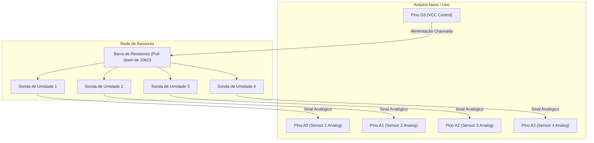
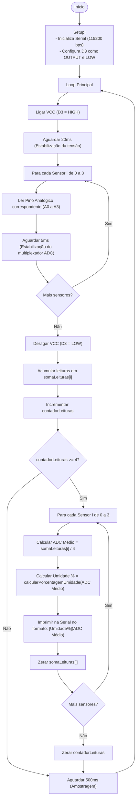

# Documentação e Diagramas de Blocos — sensores.cpp

Este documento descreve a arquitetura de hardware e o fluxo de software do módulo de teste para sensores de umidade do solo, implementado no arquivo [sensores.cpp](file:///j:/Meu%20Drive/GDrive%20Meus%20Documentos/Projetos%20(1)/PlatformIO/Projects/m360_horta/src/test/Sensores%20de%20Umidade/sensores.cpp).

O principal objetivo deste firmware de teste é realizar leituras sequenciais calibradas de 4 sensores de umidade, mitigando o efeito de eletrólise nas sondas através do chaveamento dinâmico da alimentação (VCC) via pino digital.

---

## 1. Conexão de Hardware (Mapeamento de Pinos)

| Componente / Recurso | Tipo de Sinal | Pino Arduino | Descrição / Função |
| :--- | :--- | :--- | :--- |
| **Controle VCC** | Digital (Saída) | `D3` (GPIO 3) | Controla a alimentação da barra de resistores de 10kΩ dos sensores para evitar corrosão galvânica (eletrólise). |
| **Sensor de Umidade 1** | Analógico (Entrada) | `A0` | Canal de leitura do primeiro sensor de solo. |
| **Sensor de Umidade 2** | Analógico (Entrada) | `A1` | Canal de leitura do segundo sensor de solo. |
| **Sensor de Umidade 3** | Analógico (Entrada) | `A2` | Canal de leitura do terceiro sensor de solo. |
| **Sensor de Umidade 4** | Analógico (Entrada) | `A3` | Canal de leitura do quarto sensor de solo. |

### Diagrama de Conexão Física (Blocos)



---

## 2. Fluxograma de Software

O algoritmo realiza amostragens periódicas acumulando as leituras. A cada 4 ciclos de amostragem, calcula a média móvel, converte o valor bruto do conversor analógico-digital (ADC) para porcentagem (baseado na calibração) e exibe os resultados na Serial.



---

## 3. Lógica de Calibração e Conversão

A função `calcularPorcentagemUmidade` mapeia linearmente o valor medido no ADC para uma escala de 0% (seco) a 100% (totalmente úmido).

### Limites Calibrados
- **Solo Seco (0% Umidade):** `VALOR_SECO = 1020`
- **Solo Úmido (100% Umidade):** `VALOR_UMIDO = 450`

```cpp
int calcularPorcentagemUmidade(int valorLido) {
  if (VALOR_SECO == VALOR_UMIDO) {
    return 0;
  }
  int umidade = map(valorLido, VALOR_SECO, VALOR_UMIDO, 0, 100);
  return constrain(umidade, 0, 100); // Garante o intervalo de 0 a 100%
}
```

---

## 4. Estratégias de Confiabilidade do Sinal

1. **Mitigação de Eletrólise:** A alimentação das sondas via pino `D3` fica ativa apenas por `20ms + (4 * 5ms) = 40ms` a cada ciclo de amostragem de `540ms` (~7.4% de duty cycle), reduzindo drasticamente o desgaste por corrosão galvânica das sondas metálicas no solo.
2. **Estabilização do Multiplexador ADC:** O delay de `5ms` inserido entre a leitura de canais analógicos adjacentes permite a descarga adequada do capacitor interno de *sample and hold* do microcontrolador, evitando que o valor lido em um sensor influencie o canal seguinte (crosstalk).
3. **Média Móvel de Amostragem (Filtro Passa-Baixas):** Ao calcular a média a cada 4 leituras brutas antes do envio, são filtrados ruídos de alta frequência induzidos na fiação dos sensores.
