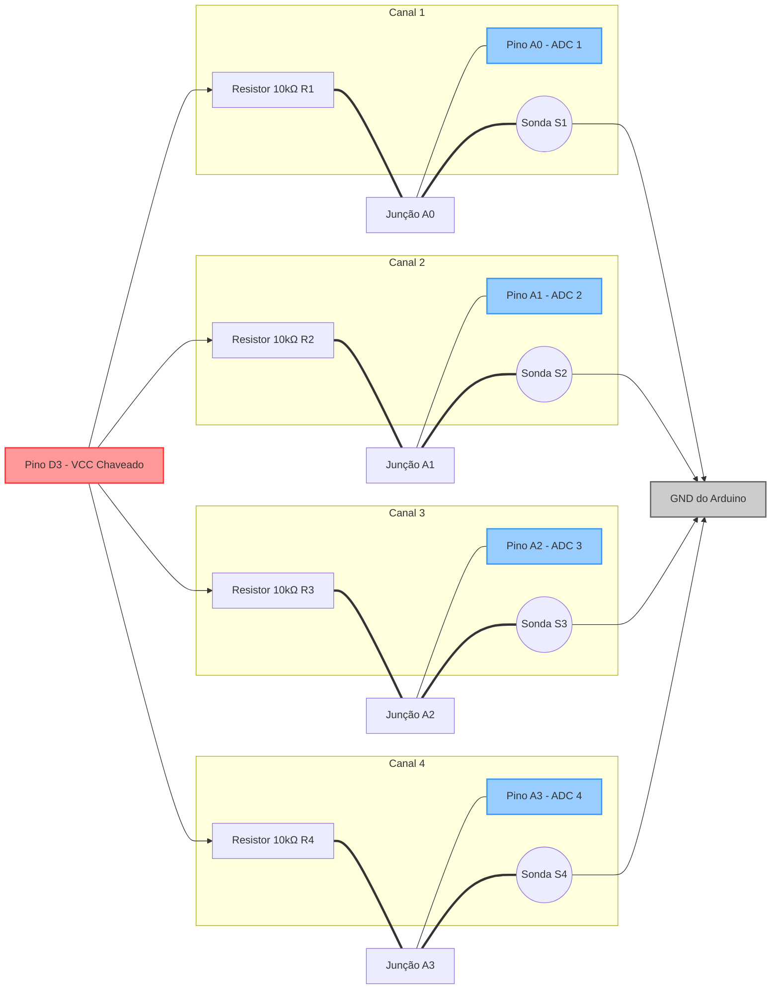

# Esquema Elétrico — Leitura Calibrada de Sensores de Umidade

Este documento descreve o esquema elétrico detalhado para a conexão de 4 sensores de umidade resistivos a um Arduino, conforme o mapeamento e especificações do arquivo [diagrama de blocos.md](file:///j:/Meu%20Drive/GDrive%20Meus%20Documentos/Projetos%20(1)/PlatformIO/Projects/m360_horta/src/test/Sensores%20de%20Umidade/diagrama%20de%20blocos.md) e do firmware [sensores.cpp](file:///j:/Meu%20Drive/GDrive%20Meus%20Documentos/Projetos%20(1)/PlatformIO/Projects/m360_horta/src/test/Sensores%20de%20Umidade/sensores.cpp).

---

## 1. Topologia do Circuito (Divisor de Tensão)

Para realizar a leitura de sensores resistivos usando o Conversor Analógico-Digital (ADC) do Arduino, utiliza-se a topologia de **Divisor de Tensão**. 

Cada canal de sensor é composto por:
1. Um **resistor fixo de 10kΩ** conectado à linha de alimentação chaveada (`D3`).
2. A **sonda de umidade resistiva** (que atua como um resistor variável $R_{sensor}$) conectada entre a entrada analógica correspondente e o terra (`GND`).

### Equação de Tensão de Saída ($V_{out}$)

$$V_{out} = V_{D3} \cdot \frac{R_{sensor}}{10\text{k}\Omega + R_{sensor}}$$

* **Solo Seco ($R_{sensor} \rightarrow \infty$):** $V_{out} \approx V_{D3} \approx 5\text{V}$ (Leitura ADC de aprox. `1020`).
* **Solo Úmido ($R_{sensor}$ diminui):** $V_{out}$ cai em direção ao `GND`. No ponto de calibração máxima de 100% de umidade, a tensão medida corresponde a uma leitura ADC de `450` (aprox. $2,2\text{V}$).

---

## 2. Esquema Elétrico em ASCII Art

```text
                           5V (Chaveado via Pino D3)
                                      |
               +----------------------+----------------------+----------------------+
               |                      |                      |                      |
             [10k]                  [10k]                  [10k]                  [10k]   Resistores de Pull-up (R1-R4)
             (R1)                   (R2)                   (R3)                   (R4)
               |                      |                      |                      |
   A0 ---------+          A1 ---------+          A2 ---------+          A3 ---------+     Entradas Analógicas do Arduino
               |                      |                      |                      |
             o   o                  o   o                  o   o                  o   o   Pinos das Sondas Resistivas
              \ /                    \ /                    \ /                    \ /
             ( S1 )                 ( S2 )                 ( S3 )                 ( S4 )  (Haste de Medição no Solo)
               |                      |                      |                      |
               +----------------------+----------------------+----------------------+
                                      |
                                     GND (Terra Comum do Arduino)
```

---

## 3. Diagrama Esquemático (Mermaid)



---

## 4. Lista de Componentes (BOM — Bill of Materials)

| Item | Qtd. | Referência | Componente | Descrição / Especificações |
| :--- | :--- | :--- | :--- | :--- |
| **1** | 1 | U1 | Arduino Nano / Uno | Placa microcontroladora baseada no ATmega328P. |
| **2** | 4 | R1, R2, R3, R4 | Resistor Fixo 10kΩ | Filme de carbono ou metal, 1/4W (0.25W), tolerância de 1% (preferencial) ou 5%. |
| **3** | 4 | S1, S2, S3, S4 | Sondas de Umidade | Hastes de teste metálicas resistivas (duas vias condutoras expostas ao solo). |
| **4** | 1 | - | Cabos de Conexão | Jumpers de conexão para montagem em protoboard ou placa de circuito impresso. |

---

## 5. Notas Importantes sobre Montagem

1. **Localização dos Resistores:** Os resistores de 10kΩ devem ser montados o mais próximo possível das entradas analógicas do Arduino (`A0` a `A3`) para reduzir a captação de ruídos eletromagnéticos induzidos nos cabos longos que vão até os vasos ou canteiros.
2. **Terra Comum:** O terminal inferior de todas as sondas resistivas de solo deve ser conectado a um barramento comum de terra (`GND`) que retorna diretamente a um pino `GND` livre do Arduino.
3. **Calibração:** Se os valores obtidos na prática divergirem de `1020` (solo seco) e `450` (solo totalmente molhado), as constantes `VALOR_SECO` e `VALOR_UMIDO` no código [sensores.cpp](file:///j:/Meu%20Drive/GDrive%20Meus%20Documentos/Projetos%20(1)/PlatformIO/Projects/m360_horta/src/test/Sensores%20de%20Umidade/sensores.cpp) devem ser reajustadas para refletir a resistência específica das sondas e do solo utilizado.
